# 实验1: 使用用户池管控智能体访问

> 10 分钟内为您的智能体配置企业级访问控制

## 为什么需要 Inbound 认证？

### 先想一个问题

你写了一个 Agent，本地跑得很好。现在要上线给用户用了。

这时候你会遇到一个最基本的问题：**谁能调用你的 Agent？**

### 没有认证会怎样？

- **场景 1：裸奔的 Agent**

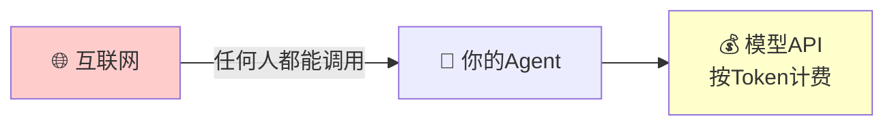

后果：

- 有人写个脚本疯狂调用，你的 API 费用一夜爆炸
- 竞争对手拿你的 Agent 做逆向工程
- 出了安全事故，你不知道是谁干的

- **场景 2：Agent 不知道"你是谁"**

很多 Agent 需要根据用户身份提供个性化服务：

- 查"我的订单" —— 哪个"我"？
- 访问"我的文档" —— 哪个"我"？
- 执行敏感操作 —— 你有权限吗？

没有身份信息，Agent 要么拒绝服务，要么只能提供最基础的公开功能。

- **场景 3：审计和合规**

安全团队、CISO 会问你：

- 这个 Agent 谁在用？
- 用了多少次？
- 有没有异常调用？

你答不上来，合规审计直接挂掉。金融、医疗、政企客户根本不会用。

### 核心问题：入站身份

把链路画出来就很清楚：

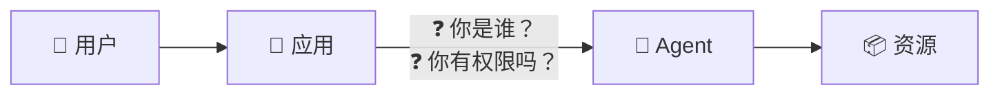

这就是 **Inbound（入站）认证** 要解决的事：

1. **认证**：证明"你是你"
2. **授权**：确认"你能用"
3. **传递**：把身份信息带给 Agent

### Agent Identity 怎么解决？

我们提供开箱即用的 **用户池** 方案：

| 能力 | 说明 |
| ------ | ------ |
| **统一用户目录** | 一个地方管理所有能访问 Agent 的用户 |
| **标准协议** | OAuth2/OIDC，不用自己造轮子 |
| **JWT Token** | 无状态认证，高性能，身份信息可传递给 Agent |
| **企业级安全** | 支持 MFA、密码策略、登录审计 |

配置完成后，调用链路变成：

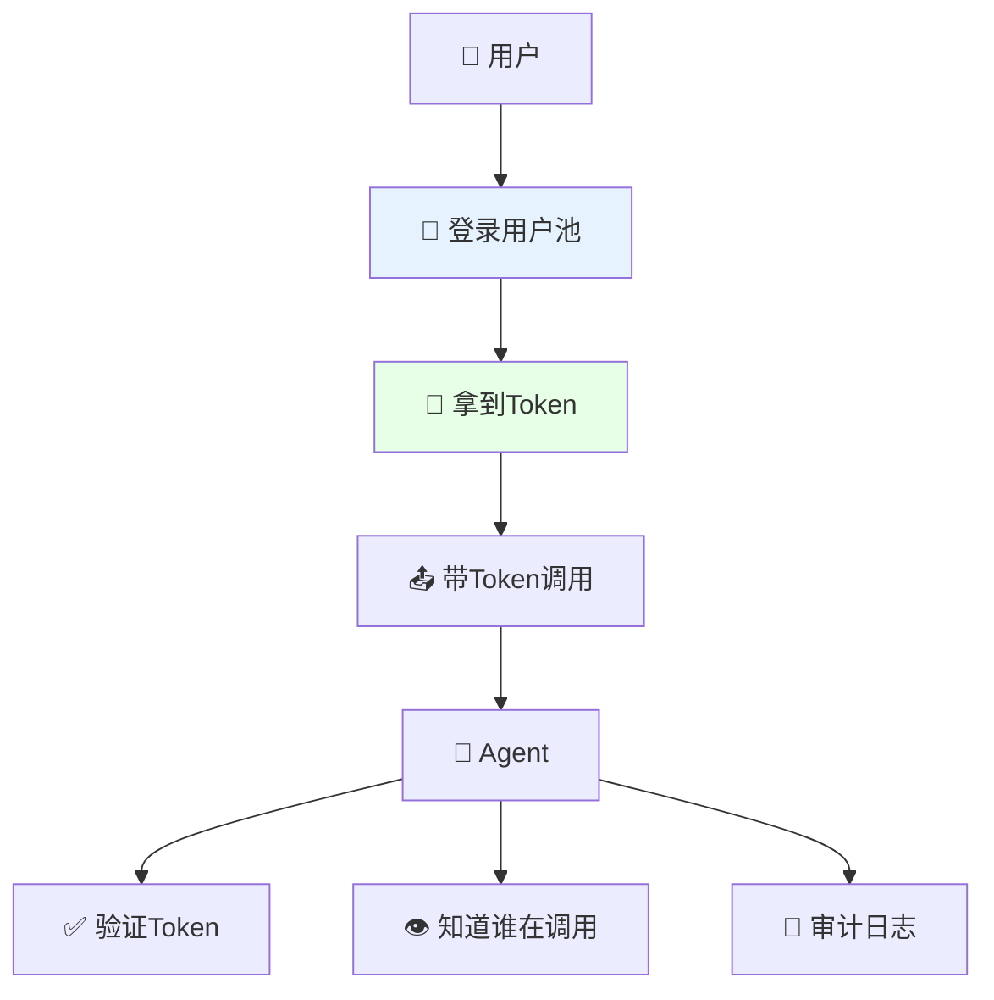

**10 分钟配置，解决三个问题：谁能用、谁在用、用了什么。**

---

## 快速开始

### 前置准备

| 项目 | 说明 |
| ------ | ------ |
| **火山控制台账号** | 需要 AgentKit Administrator 权限的子账号 |
| **Python 环境** | Python 3.12+ 及 [uv](https://docs.astral.sh/uv/) |
| **AgentKit CLI** | 参考 [AgentKit CLI安全指南](https://volcengine.github.io/agentkit-sdk-python/content/1.introduction/2.installation.html) |


### 步骤1: 创建用户池和用户（控制台操作）
1. **访问 Agent Identity 控制台**

2. 打开 [用户池管理页面](https://console.volcengine.com/identity/region:identity+cn-beijing/user-pools)

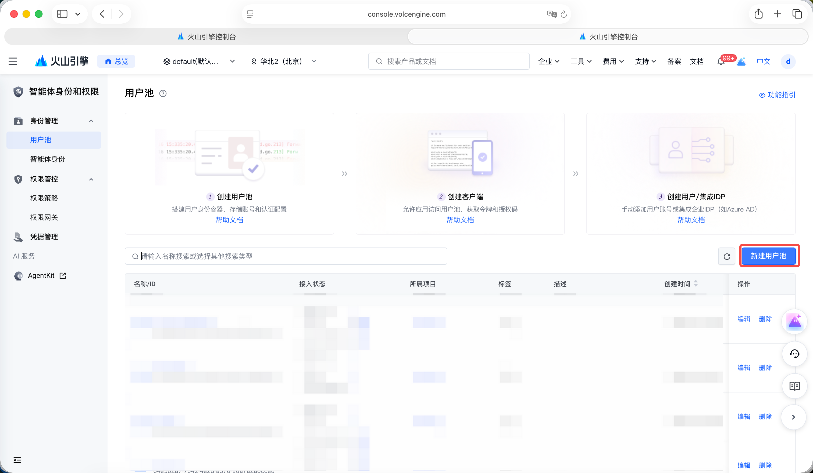

3. **新建用户池**
	- 点击「新建用户池」
	- 填写用户池名称（如 `my_agent_users`）
	- 选择登录属性：用户名 + 手机号
	- 点击「确认」


4. **新建客户端**
	- 进入用户池详情 → 点击「新建客户端」
	- 客户端名称：`agent_web_client`
	- 客户端类型：Web 应用
	- 回调地址：`http://127.0.0.1:8082/callback`
	- **记录 Client ID 和 Client Secret**


5. **创建测试用户**
	- 在用户池中选择「用户管理」→「新建用户」
	- 设置用户名和临时密码

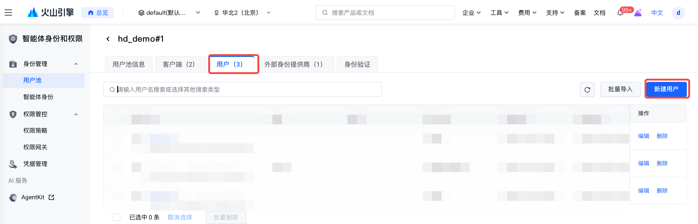

### 步骤2: 测试身份池登录
#### 配置环境变量
1. 复制环境变量模板：

```bash
# 确保位于正确的目录
cd tutorial-1-userpool-inbound

# 从模板创建.env
cp .env.template .env
```

2. 编辑 `.env` 文件：

> 在本步骤中，`AGENT_NAME`和 `AGENT_ENDPOINT` 可以不用修改。
> 

从控制台找到正确 `OAUTH2_ISSUER_URI`、`OAUTH2_CLIENT_ID` 和`OAUTH2_CLIENT_SECRET`，填入配置文件中

```bash
***# OAuth2 配置（从控制台复制）
OAUTH2_ISSUER_URI=https://userpool-<USERPOOL_ID>.userpool.auth.id.<REGION>.volces.com
OAUTH2_CLIENT_ID=<OAuth2 Client ID>
OAUTH2_CLIENT_SECRET=<OAuth2 Client Secret>
OAUTH2_REDIRECT_URI=http://127.0.0.1:8082/callback
**OAUTH2_SCOPES='openid profile email'***
```

#### 安装依赖
```bash
uv venv --python=3.12
uv pip install -r requirements.txt
```

#### 测试OAuth登录
1. 启动测试Web应用：

```bash
python oauth2_testapp.py
```

2. 打开浏览器访问 [http://127.0.0.1:8082](http://127.0.0.1:8082/)，点击"Sign in"

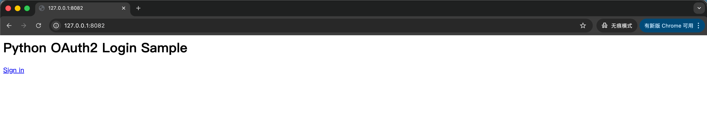

3. 浏览器会跳转到用户池的登录页，用此前在控制台创建所用户的用户名/密码登录


4. 登录成功会跳转到授权页，点击"允许访问"

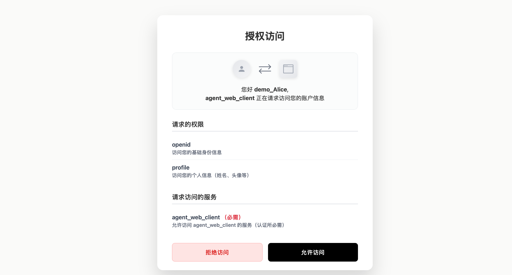

5. 浏览器跳转页面会显示获得的Access Token，以及从Token中解析出来的字段，其中：

- `aud`和`client_id`是本客户端使用的OAuth2客户端ID（`OAUTH2_CLIENT_ID`变量）

- `iss`是本客户端使用的用户池的颁发服务地址（`OAUTH2_ISSUER_URI`变量）

- `sub`是登录用户的`user_id`

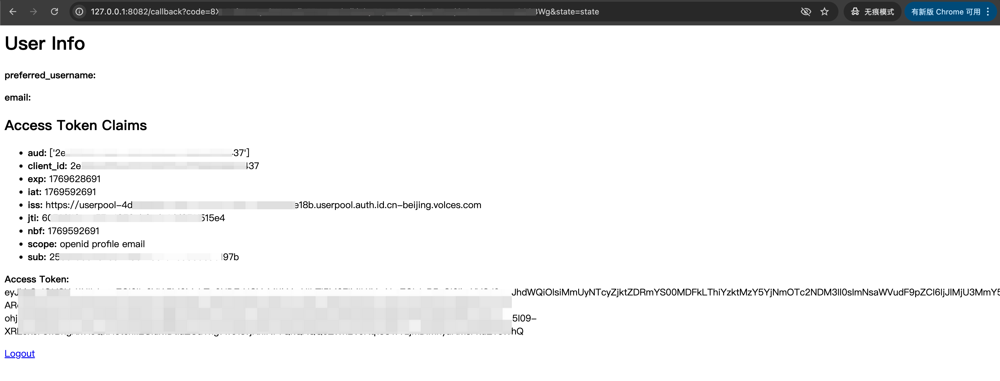

### 步骤3: 验证身份信息
前面的流程介绍了如何通过OAuth2登录流程来获取身份池颁发的Access Token，本节会介绍AgentKit是如何消费Access Token来验证身份信息的。

#### 理解身份验证流程
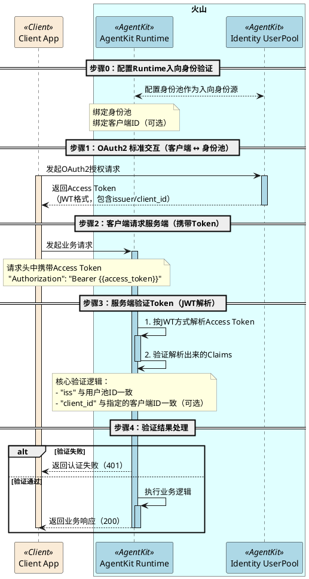


#### 启用身份池验证
当创建AgentKit Runtime时，可以指定使用**OAuth JWT**模式进行入站身份认证，此时需要同时指定绑定的身份池，并（可选的）指定允许的客户端。

- 如果是通过[AgentKit Runtime控制台](https://console.volcengine.com/agentkit/region:agentkit+cn-beijing/runtime/create)创建，则配置方式见下图： 

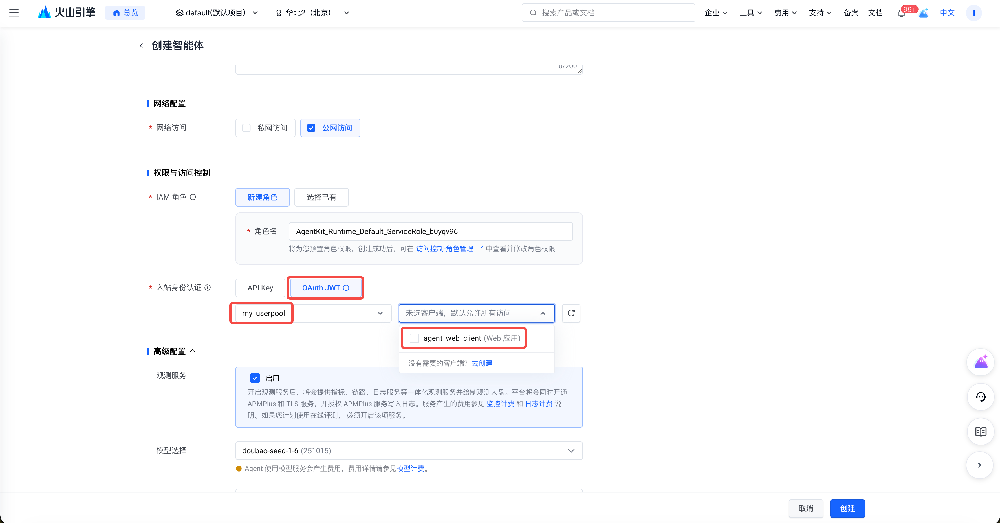

- 如果是通过 AgentKit CLI创建Runtime，则需要在 agentkit.yml中进行如下配置：
	- 将`runtime_auth_type`设置为`custom_jwt`
	- 将`runtime_jwt_discovery_url`设置为用户池的“OIDC 发现端点 Discovery URL”
	- （可选）将`runtime_jwt_allowed_clients`设置为允许的一个或者多个客户端的ClientID


下一节我们将使用AgentKit CLI来实际部署一个智能体到AgentKit runtime上，并且开启身份验证。


#### 部署一个目标Agent
1. 创建agentkit部署配置

```bash
# 进入 test_agent 目录，这里准备好了一个目标Agent
cd tutorial-1-userpool-inbound/test_agent

# 从模板创建一份agentkit.yaml配置文件
cp agentkit.yaml.template agentkit.yaml
```

1. 修改 agentkit.yaml 配置文件，配置正确的`runtime_jwt_discovery_url` 和（可选）`runtime_jwt_allowed_clients`

```yaml
common:
  agent_name: identity_demo_inbound
  entry_point: agent.py
  description: 这是一个简单的智能体，可以帮你查询天气
  language: Python
  language_version: '3.12'
  agent_type: Basic App
  dependencies_file: requirements.txt
  runtime_envs: {}
  launch_type: cloud
launch_types:
  cloud:
    region: cn-beijing
    # 必须配置，指定使用OAuth2 JWT来验证身份
    runtime_auth_type: custom_jwt
    # 必须配置，指定绑定的用户池
    # USERPOOL_DISCOVERY_URL可以在用户池页面找到（“OIDC 发现端点 Discovery URL”）
    # 通常格式为：https://userpool-<USERPOOL_ID>.userpool.auth.id.cn-beijing.volces.com/.well-known/openid-configuration
    runtime_jwt_discovery_url: <USERPOOL_DISCOVERY_URL>
    # 可选配置，指定允许的客户端
    runtime_jwt_allowed_clients:
    - <CLIENT_ID_1>
    - <CLIENT_ID_2>
```

1. 运行部署命令

```bash
# 将火山AK/SK配置到环境变量中，确保AK/SK有发布runtime的权限
export VOLCENGINE_ACCESS_KEY=<火山AK>
export VOLCENGINE_SECRET_KEY=<火山SK>

# 确保当前位于 tutorial-1-userpool-inbound/test_agent 目录
agentkit launch
```

若部署成功可以看到“Launch Successfully”的提示：

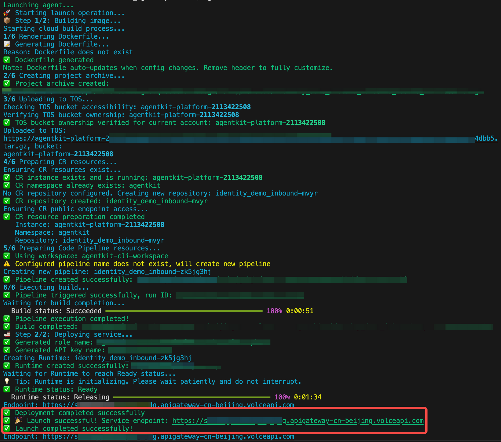

记录下**&nbsp;Service endpoint 地址**（通常格式为https://xxxx.apigateway-<region>.volceapi.com ），在下一节测试中我们使用到。


1. 完成部署后，在Runtime控制界面也能看到我们部署的Agent

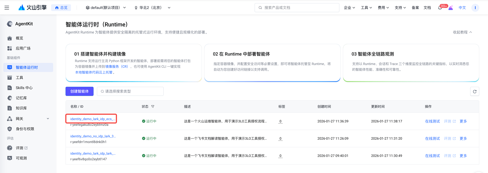

点击名称进入Runtime详情页，可以查看绑定的身份池，确认与预期身份池一致。

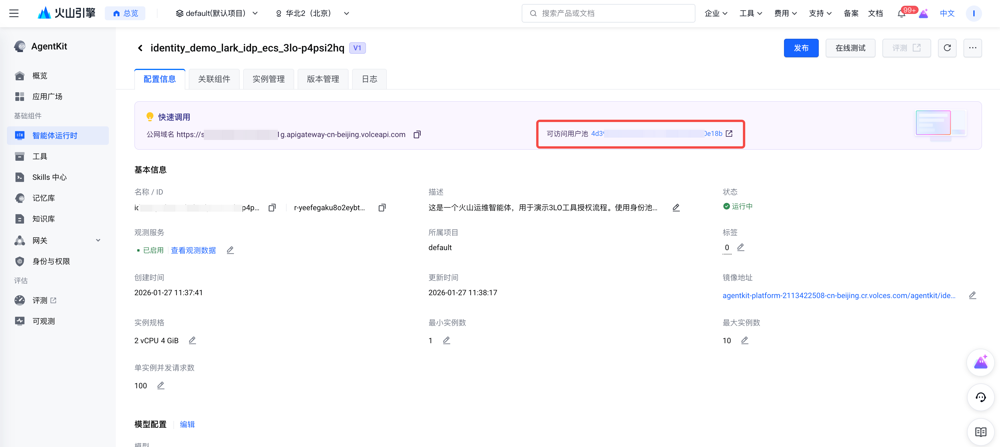


#### 测试Agent身份验证
使用步骤2得到的OAuth2 access token，可以进行一个快速的身份验证测试

```bash
# 设置runtime的入口地址
# 这个地址的格式通常是：https://xxxx.apigateway-<region>.volceapi.com  
export AGENT_ENDPOINT='<你部署的Agent的ENDPOINT>'

# 设置Access Token
# 可以使用前面身份池登录测试中得到的Access Token
export ACCESS_TOKEN='<OAuth2登录后获得的Access Token>'

curl $AGENT_ENDPOINT'/invoke' \
  -H 'authorization: Bearer '$ACCESS_TOKEN \
  -H 'content-type: application/json' \
  --data-raw $'{"prompt": "你能做什么？"}'
```


### 步骤4: 完整的客户端体验
#### 配置环境变量
1. 复制环境变量模板并填写：

```bash
# 确保当前位于 tutorial-1-inbound-userpool 目录
cp .env.template .env
```

1. 编辑 `.env` 文件

- 配置`AGENT_ENDPOINT`变量为刚才发布到AgentKit Runtime上服务的端口

- 配置OAuth2各项配置（与步骤2类似）

```bash
***# OAuth2 配置
OAUTH2_ISSUER_URI=https://userpool-<USERPOOL_ID>.userpool.auth.id.<REGION>.volces.com
OAUTH2_CLIENT_ID=<OAuth2 Client ID>
OAUTH2_CLIENT_SECRET=<OAuth2 Client Secret>
OAUTH2_REDIRECT_URI=http://127.0.0.1:8082/callback
OAUTH2_SCOPES='openid profile email'

# 目标Agent配置
AGENT_NAME='默认智能体'
**AGENT_ENDPOINT=<AgentKit Runtime Endpoint>***
```

#### 安装依赖
```bash
uv venv --python=3.12
uv pip install -r requirements.txt
```

#### 运行客户端
1. 启动应用

```bash
uv run app.py
```

2. 在浏览器打开 http://127.0.0.1:8082 ，直接输入请求会返回401未授权


3. 点击登录完成登录流程（与步骤2类似），然后再输入请求会正确返回响应

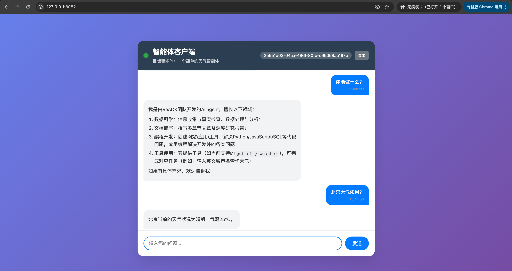

---

## 核心能力回顾
>
> "通过 Agent Identity，您可以在 **10 分钟内**为智能体配置企业级访问控制，
> 确保只有授权用户才能使用 Agent 服务。
>
> - **安全合规**：满足金融、医疗等行业的身份认证要求
> - **统一管理**：集中管理用户，支持 MFA 二次验证
> - **无缝集成**：标准 OAuth2 协议，易于与现有系统对接
> - **审计追溯**：每次访问都有记录，满足审计需求"

---

**关键点说明：**

- 所有请求都会验证 JWT Token
- 未授权请求返回 401 错误

---

## 进阶: 与飞书/企业 IdP 集成

想让用户使用飞书账号登录？请参考：

→ [实验2: 飞书 IdP 联合登录](../tutorial-2-feishu-idp/README.md)

---

## 常见问题

| 问题 | 解决方案 |
| ------ | ------ |
| 登录页面一直跳转 | 清除浏览器缓存，检查回调地址配置 |
| Token 过期 | 默认 10 小时有效，可配置刷新机制 |
| 忘记 Client Secret | 在控制台重新生成 |

---

## 相关资源

- [Agent Identity 产品文档](https://www.volcengine.com/docs/identity)
