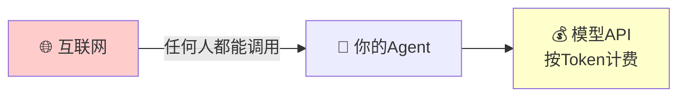
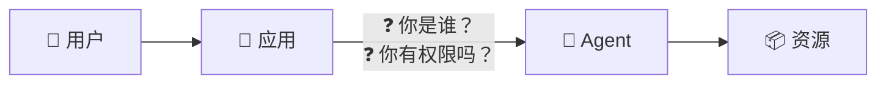
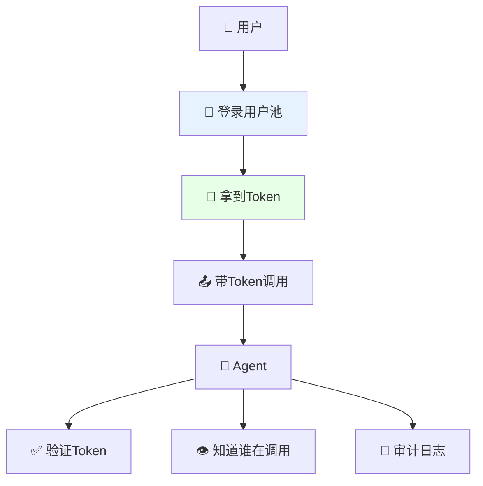
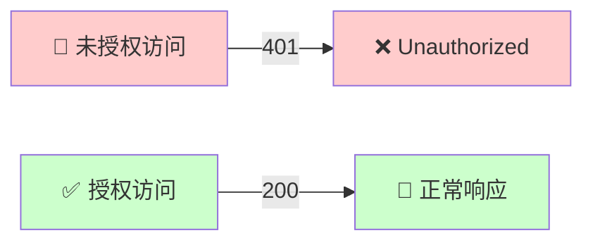

# 实验1: 使用用户池管控智能体访问

> 10 分钟内为您的智能体配置企业级访问控制

## 为什么需要 Inbound 认证？

### 先想一个问题

你写了一个 Agent，本地跑得很好。现在要上线给用户用了。

这时候你会遇到一个最基本的问题：**谁能调用你的 Agent？**

### 没有认证会怎样？

**场景 1：裸奔的 Agent**



后果：
- 有人写个脚本疯狂调用，你的 API 费用一夜爆炸
- 竞争对手拿你的 Agent 做逆向工程
- 出了安全事故，你不知道是谁干的

**场景 2：Agent 不知道"你是谁"**

很多 Agent 需要根据用户身份提供个性化服务：
- 查"我的订单" —— 哪个"我"？
- 访问"我的文档" —— 哪个"我"？
- 执行敏感操作 —— 你有权限吗？

没有身份信息，Agent 要么拒绝服务，要么只能提供最基础的公开功能。

**场景 3：审计和合规**

安全团队、CISO 会问你：
- 这个 Agent 谁在用？
- 用了多少次？
- 有没有异常调用？

你答不上来，合规审计直接挂掉。金融、医疗、政企客户根本不会用。

### 核心问题：入站身份

把链路画出来就很清楚：



这就是 **Inbound（入站）认证** 要解决的事：
1. **认证**：证明"你是你"
2. **授权**：确认"你能用"
3. **传递**：把身份信息带给 Agent

### Agent Identity 怎么解决？

我们提供开箱即用的 **用户池** 方案：

| 能力 | 说明 |
|------|------|
| **统一用户目录** | 一个地方管理所有能访问 Agent 的用户 |
| **标准协议** | OAuth2/OIDC，不用自己造轮子 |
| **JWT Token** | 无状态认证，高性能，身份信息可传递给 Agent |
| **企业级安全** | 支持 MFA、密码策略、登录审计 |

配置完成后，调用链路变成：



**10 分钟配置，解决三个问题：谁能用、谁在用、用了什么。**

---

## 快速开始

### 步骤1: 创建用户池和用户（控制台操作）

1. **访问 Agent Identity 控制台**

   打开 [用户池管理页面](https://console.volcengine.com/identity/region:identity+cn-beijing/user-pools)

2. **新建用户池**
   - 点击「新建用户池」
   - 填写用户池名称（如 `my_agent_users`）
   - 选择登录属性：用户名 + 手机号
   - 点击「确认」


3. **新建客户端**
   - 进入用户池详情 → 点击「新建客户端」
   - 客户端名称：`agent_web_client`
   - 客户端类型：Web 应用
   - 回调地址：`http://127.0.0.1:8000/api/v1/oauth2callback`
   - **记录 Client ID 和 Client Secret**


4. **创建测试用户**
   - 在用户池中选择「用户管理」→「新建用户」
   - 设置用户名和临时密码


### 步骤2: 配置环境变量

复制环境变量模板并填写：

```bash
cp .env.example .env
```

编辑 `.env` 文件：

```bash
# 用户池配置（从控制台复制）
ADK_OAUTH2_USERPOOL_UID=your-userpool-uid
ADK_OAUTH2_CLIENT_ID=your-client-id
ADK_OAUTH2_CLIENT_SECRET=your-client-secret
ADK_OAUTH2_CALLBACK_URL=http://127.0.0.1:8000/api/v1/oauth2callback
ADK_OAUTH2_SCOPE="openid profile"

# 火山云凭证
VOLCENGINE_ACCESS_KEY=your-access-key
VOLCENGINE_SECRET_KEY=your-secret-key
```

### 步骤3: 启动 Agent 应用

```bash
# 安装依赖（首次运行）
uv sync

# 启动服务
uv run veadk web
```

服务启动后，访问 http://127.0.0.1:8000

### 步骤4: 用户登录体验

1. **访问应用** - 浏览器打开 http://127.0.0.1:8000
2. **跳转登录** - 自动跳转到用户池登录页面
3. **输入凭证** - 使用步骤1创建的用户登录
4. **首次修改密码** - 如有要求，设置新密码
5. **授权确认** - 允许应用访问您的信息
6. **进入应用** - 登录成功，可以开始使用 Agent




---

## 核心能力回顾
>
> "通过 Agent Identity，您可以在 **10 分钟内**为智能体配置企业级访问控制，
> 确保只有授权用户才能使用 Agent 服务。
>
> - **安全合规**：满足金融、医疗等行业的身份认证要求
> - **统一管理**：集中管理用户，支持 MFA 二次验证
> - **无缝集成**：标准 OAuth2 协议，易于与现有系统对接
> - **审计追溯**：每次访问都有记录，满足审计需求"

---


**关键点说明：**
- `veadk web` 命令自动读取环境变量中的 OAuth2 配置
- 所有请求都会验证 JWT Token
- 未授权请求返回 401 错误

---

## 进阶: 与飞书/企业 IdP 集成

想让用户使用飞书账号登录？请参考：

→ [实验2: 飞书 IdP 联合登录](../tutorial-2-feishu-idp/README.md)

---

## 常见问题

| 问题 | 解决方案 |
|------|----------|
| 登录页面一直跳转 | 清除浏览器缓存，检查回调地址配置 |
| Token 过期 | 默认 10 小时有效，可配置刷新机制 |
| 忘记 Client Secret | 在控制台重新生成 |

---

## 相关资源

- [Agent Identity 产品文档](https://www.volcengine.com/docs/identity)
- [VeADK 开发指南](https://volcengine.github.io/agentkit-sdk-python/)
