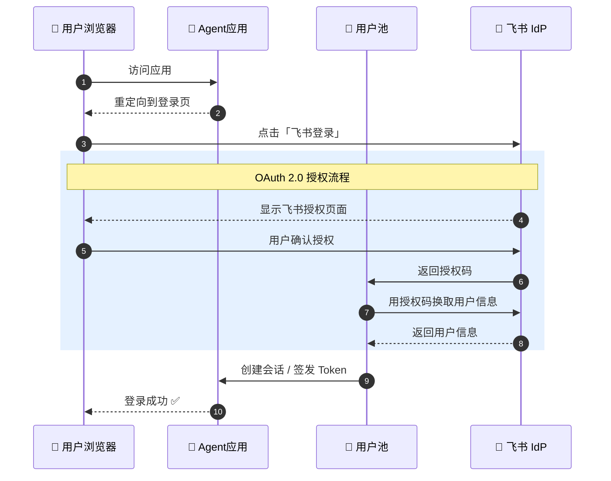

# 实验2: 飞书 IdP 联合登录

> 使用飞书账号作为企业身份源，实现智能体的单点登录(SSO)

## 业务场景

企业已经在使用飞书作为统一通讯和办公平台，员工都有飞书账号。现在要部署 AI 智能体，如何让员工使用飞书账号直接登录，而不是再创建一套新的账号？

**传统方案的问题：**
- 每个系统维护独立用户库 → 用户需要记忆多套密码
- 用户离职/入职需要多个系统同步 → 管理成本高、遗漏风险
- 无法利用飞书的 MFA/安全策略 → 安全合规难以统一

**Agent Identity 解决方案：**
- 飞书作为身份源(IdP)，用户池作为服务提供者(SP)
- 一键登录，无需额外注册
- 继承飞书的安全策略和审计能力

## 与实验1的区别

| 对比项 | 实验1 (用户池登录) | 实验2 (飞书联合登录) |
|--------|-------------------|---------------------|
| 账号来源 | 用户池本地创建 | 飞书通讯录 |
| 登录方式 | 用户名/密码 | 飞书授权 |
| 适用场景 | 独立用户管理 | 企业统一身份 |
| 用户体验 | 需要注册 | 一键登录 |

## 核心流程



## 快速开始

### 前置条件

- 完成实验1的用户池创建和客户端配置
- 拥有飞书开放平台账号（https://open.feishu.cn/）

---

### 步骤1: 创建飞书应用

1. **登录飞书开放平台**

   访问 [飞书开放平台](https://open.feishu.cn/) → 点击「创建应用」


2. **创建企业自建应用**
   - 应用类型：企业自建应用
   - 应用名称：`Agent Identity Demo`（自定义）
   - 应用描述：Agent 身份认证测试

3. **获取应用凭证**

   进入应用详情 → 「凭证与基础信息」，记录：
   - **App ID**（客户端 ID）
   - **App Secret**（客户端密钥）


4. **⚠️ 配置安全设置（最关键的一步！）**

   进入「安全设置」→ 添加重定向 URL。

   > **重要：不要自己拼接 URL！请按以下步骤获取正确的回调地址：**
   >
   > 1. 打开 [火山引擎用户池控制台](https://console.volcengine.com/identity/region:identity+cn-beijing/user-pools)
   > 2. 进入你的用户池 → 左侧菜单「外部身份供应商」→「添加供应商」
   > 3. 选择「飞书」类型后，页面会显示「重定向 URI」
   > 4. **直接复制该地址**，粘贴到飞书的「安全设置」中

   回调 URL 格式类似：
   ```
   https://userpool-<用户池UID>.userpool.auth.id.cn-beijing.volces.com/login/generic_oauth/callback
   ```

   > ⚠️ **常见错误**：
   > - 不要使用 `127.0.0.1:8000` 作为重定向 URL（这是 Agent 应用地址，不是 OAuth 回调地址）
   > - 不要漏掉 `/login/generic_oauth/callback` 路径
   > - URL 必须与控制台显示的完全一致，包括协议 `https://`


5. **网页应用配置（可选，非必须）**

   飞书可能提示配置「网页应用」，这是**可选的**：

   | 配置项 | 说明 | 是否必须 |
   |--------|------|----------|
   | 安全设置 → 重定向 URL | OAuth 回调地址 | ✅ 必须 |
   | 网页应用 → 桌面端主页 | 从飞书打开应用的地址 | ❌ 可选 |

   > **说明**：「网页应用主页」是用户从飞书客户端点击应用图标时的跳转地址。
   > 如果只是用飞书做身份认证（IdP），不需要用户从飞书内打开应用，可以不启用「网页应用」能力。
   >
   > **关键是步骤4的「安全设置」中的重定向 URL，这个必须正确配置！**

6. **⚠️ 添加权限（必须完整申请！）**

   进入「权限管理」→ 搜索并申请以下权限：

   | 权限 | 说明 | 是否必须 |
   |------|------|----------|
   | `contact:user.base:readonly` | 获取用户基本信息 | ✅ 必须 |
   | `contact:contact.base:readonly` | 获取通讯录基本信息 | ✅ 必须 |
   | `contact:user.employee_id:readonly` | 获取用户工号 | ❌ 可选 |

   > ⚠️ **重要提醒**：
   > - 火山引擎用户池默认会请求 `contact:contact.base:readonly` 权限
   > - **如果不申请这个权限，登录时会报错 `20027 当前应用未申请相关权限`**
   > - 两个必须权限缺一不可！


7. **发布应用**

   完成配置后，点击「创建版本并发布」使应用生效。

   > **注意**：每次修改权限或配置后，都需要重新发布应用才能生效！

---

### 步骤2: 在用户池配置飞书 IdP

1. **进入用户池控制台**

   访问 [Agent Identity 控制台](https://console.volcengine.com/identity/region:identity+cn-beijing/user-pools)

2. **选择用户池** → 进入详情页

3. **添加外部身份供应商**

   左侧菜单 →「外部身份供应商」→「添加供应商」

   填写信息：
   | 字段 | 值 | 说明 |
   |------|------|------|
   | 供应商类型 | 飞书 | 选择飞书 |
   | 供应商名称 | feishu | 自定义名称 |
   | 客户端 ID | 步骤1获取的 App ID | 从飞书应用凭证复制 |
   | 客户端密钥 | 步骤1获取的 App Secret | 从飞书应用凭证复制 |
   | 授权范围 | `contact:user.base:readonly` | 默认即可 |

4. **保存配置**

   > 保存后，页面会显示「重定向 URI」，确认这个 URL 已经添加到飞书应用的「安全设置」中。


配置完成后，用户池登录页面将显示「使用飞书登录」按钮。

---

### 步骤3: 配置环境变量

```bash
# 进入教程目录
cd python/01-tutorials/03-agentkit-identity/02_feishu_idp

# 复制环境变量模板
cp .env.example .env

# 编辑 .env 填写配置（与实验1相同）
```

> **提示**：本实验复用实验1的用户池配置，.env 文件内容与实验1相同。

---

### 步骤4: 安装依赖并启动

```bash
# 安装依赖
uv sync

# 启动服务
uv run veadk web
```

> **端口冲突？** 如果提示 `address already in use`，说明端口 8000 被占用。
> 运行以下命令清理：
> ```bash
> lsof -i :8000 | grep -v "^COMMAND" | awk '{print $2}' | xargs kill -9
> ```

---

### 步骤5: 飞书登录体验

1. 浏览器访问 `http://127.0.0.1:8000`
2. 在登录页面点击 **「使用飞书登录」**
3. 跳转到飞书授权页面，点击 **「授权」**
4. 返回应用后，点击 **「允许访问」**
5. 成功登录，开始与 Agent 对话


## 测试提示词

```
你好，我是通过飞书登录的，请介绍一下你自己
```

## 预期结果

成功登录后，Agent 将返回欢迎信息。用户的飞书身份信息（如用户名、组织）可用于后续的权限控制和审计。

---

## 常见问题排查

### 错误速查表

| 错误码/现象 | 原因 | 解决方法 |
|-------------|------|----------|
| `20029` redirect_uri 请求不合法 | 飞书安全设置中的重定向 URL 与实际请求不匹配 | 从用户池控制台复制正确的「重定向 URI」到飞书安全设置 |
| `20027` 当前应用未申请相关权限 | 缺少 `contact:contact.base:readonly` 权限 | 在飞书权限管理中申请该权限，然后重新发布应用 |
| 飞书登录按钮不显示 | 未在用户池配置外部身份供应商 | 在用户池添加飞书 IdP 配置 |
| 授权后页面空白或报错 | 回调 URL 配置错误 | 确保 URL 协议、域名、路径完全一致 |
| `address already in use` | 端口 8000 被占用 | 运行 `lsof -i :8000` 查找并 kill 进程 |
| 登录后仍显示未登录 | 浏览器缓存问题 | 清除浏览器缓存或使用无痕模式 |

### 配置检查清单

在遇到问题时，请按以下顺序检查：

- [ ] **飞书应用是否已发布？** 每次修改配置后需重新发布
- [ ] **权限是否完整？** 必须包含 `contact:user.base:readonly` 和 `contact:contact.base:readonly`
- [ ] **重定向 URL 是否正确？** 从用户池控制台复制，不要手动拼接
- [ ] **用户池 IdP 配置是否正确？** App ID 和 App Secret 是否匹配
- [ ] **.env 文件是否配置正确？** 用户池 UID、Client ID、Client Secret

### 重新测试登录

如果需要重新测试登录流程：

1. 清除浏览器缓存（或使用无痕/隐私模式）
2. 确保 veadk web 进程已重启
3. 重新访问 `http://127.0.0.1:8000`

---

## 核心能力回顾

> "通过 Agent Identity 的飞书联合登录功能，您的员工无需记忆额外密码，
> 使用日常办公的飞书账号即可一键访问 AI 智能体，同时继承企业的安全管理策略。"

---

## 进阶: Outbound 凭证托管

完成联合登录后，如果需要让 Agent **代表用户**安全访问飞书文档等外部资源，请继续：

→ [实验3: Outbound 凭证托管 - 让 Agent 安全访问飞书文档](../tutorial_3_feishu_outbound/)

在实验3中，你将学习：
- 如何让 Agent 获取用户授权的飞书 Token
- 凭证托管的安全最佳实践
- 实现"凭证不落地"的 Outbound 访问模式
