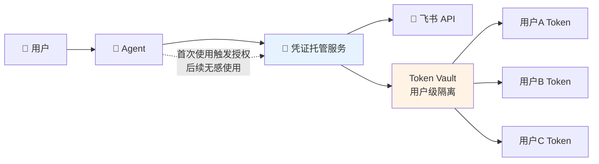
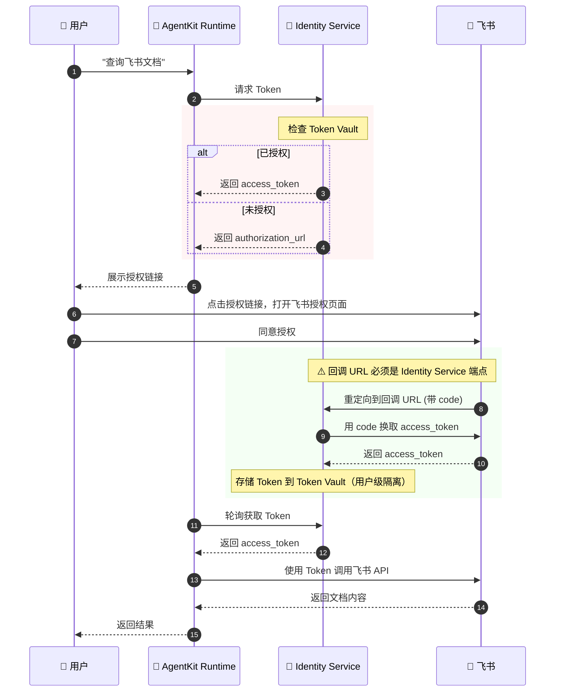
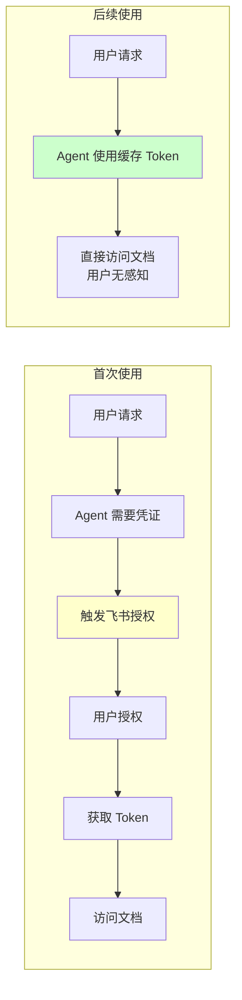

# 实验3 (进阶): 让智能体安全访问飞书文档

> 凭证托管 + OAuth2.0 三方授权 + AgentKit Runtime 部署

⚠️ **重要说明**：本教程是**进阶教程**，需要部署到 AgentKit Runtime 才能完整运行。
这是因为 **Outbound 凭证托管** 依赖 **工作负载身份 (Workload Identity)**，
而工作负载身份只有在 AgentKit Runtime 中才会自动分配。

---

## 业务场景

想象这样的场景：

> 用户对 Agent 说："帮我总结一下那个飞书文档的内容"
>
> Agent 需要访问用户的飞书文档，但是...
> - **飞书 API 需要授权**
> - **每个用户的授权是独立的**
> - **凭证怎么安全管理？**

### 传统方案的问题

| 方案 | 问题 |
|------|------|
| **硬编码凭证** | AK/SK 写在代码里，泄露风险极高 |
| **共享凭证** | 所有用户用同一个 Token，无法追溯谁做了什么 |
| **手动管理** | 每个用户单独管理 Token，运维成本爆炸 |
| **Token 过期** | 手动刷新 Token，用户体验差 |

---

## Agent Identity 解决方案

### 凭证托管 (Credential Provider)



### 核心优势

| 特性 | 说明 |
|------|------|
| **凭证不落地** | AK/SK 由平台统一管理，不在代码中出现 |
| **用户级隔离** | 每个用户的飞书授权独立管理 |
| **OAuth 自动化** | 首次使用引导授权，后续自动刷新 Token |
| **安全审计** | 所有凭证使用都有记录 |
| **工作负载身份** | AgentKit Runtime 自动分配，无需手动配置 |

---

## OAuth 完整流程详解

> ⚠️ **理解这个流程是避免踩坑的关键！**



### 🔴 关键配置点

| 配置项 | 正确值 | 常见错误 |
|--------|--------|----------|
| **凭证提供者回调 URL** | `https://auth.id.cn-beijing.volces.com/api/v1/oauth2callback` | ❌ 错误地设为 Runtime URL（会导致 "Consumer authentication failed"） |
| **飞书安全设置重定向 URL** | `https://auth.id.cn-beijing.volces.com/api/v1/oauth2callback` | ❌ 只添加了本地开发 URL |
| **飞书权限范围** | `drive:drive,docx:document:readonly,offline_access` | ❌ 使用 `openid` 等标准 OIDC scope（飞书不支持） |

---

## 运行环境说明

本教程的 **Outbound 凭证托管** 功能依赖 **工作负载身份 (Workload Identity)**：

| 环境 | 工作负载身份 | 凭证托管功能 |
|------|-------------|-------------|
| 本地 veadk web | ⚠️ 需手动配置 | ✅ 可测试 |
| AgentKit Runtime | ✅ 自动分配 | ✅ 完整支持 |

### 本地开发模式

本教程**支持本地运行测试**，通过 `RUNTIME_IAM_ROLE_TRN` 环境变量模拟工作负载身份：

```bash
# 在 .env 中配置
RUNTIME_IAM_ROLE_TRN=trn:iam::<account_id>:role/<role_name>
```

> ⚠️ **前提条件**：你的 AK/SK 必须有权限 AssumeRole 到指定的 IAM Role，且该 Role 需具备 `IDReadOnly` 权限。

---

## 快速开始

### 前置条件

1. **完成基础教程**
   - 完成实验1的用户池创建和客户端配置
   - 完成实验2的飞书应用创建（可复用）

2. **安装 AgentKit CLI**
   ```bash
   pip install agentkit-cli
   ```

3. **配置 AgentKit**
   ```bash
   agentkit config --tos_bucket <your-bucket-name>
   ```

---

### 步骤1: 配置飞书应用（用于文档访问）

> **说明**：可以复用实验2创建的飞书应用，但需要添加文档访问权限。

1. **登录飞书开放平台**

   访问 [飞书开放平台](https://open.feishu.cn/)

2. **获取应用凭证**

   进入「凭证与基础信息」，记录：
   - **App ID**
   - **App Secret**

3. **⚠️ 配置安全设置（重定向 URL）**

   进入「安全设置」→ 添加重定向 URL：

   > **重要：凭证托管使用不同的回调 URL！**
   > ```
   > https://auth.id.cn-beijing.volces.com/api/v1/oauth2callback
   > ```

4. **⚠️ 添加文档访问权限（关键步骤！）**

   进入「权限管理」→ 搜索并申请以下权限：

   | 权限 | 说明 | 是否必须 |
   |------|------|----------|
   | `docx:document:readonly` | 查看、下载云文档 | ✅ 必须 |
   | `drive:drive` | 查看云空间 | ✅ 必须 |
   | `docs:document.content:read` | 读取文档内容 | ✅ 推荐 |

5. **发布应用**

   完成配置后，点击「创建版本并发布」使应用生效。

---

### 步骤2: 创建凭证提供者（Credential Provider）

> **这是本教程的核心步骤！** 在 Agent Identity 控制台创建飞书凭证提供者。

1. **访问凭证托管控制台**

   打开 [Agent Identity 控制台 → 凭证管理](https://console.volcengine.com/identity/region:identity+cn-beijing/outbound-credentials)

2. **创建凭证提供者**

   点击「创建凭证提供者」，填写以下信息：

   | 字段 | 值 | 说明 |
   |------|------|------|
   | 提供者名称 | `feishu` 或自定义 | 代码中会用到这个名称 |
   | 提供者类型 | OAuth 2.0 | 选择 OAuth 2.0 |
   | 服务商 | 飞书 | 选择飞书 |
   | Client ID | 步骤1获取的 App ID | 从飞书应用凭证复制 |
   | Client Secret | 步骤1获取的 App Secret | 从飞书应用凭证复制 |

3. **⚠️ 配置关键参数（避坑重点！）**

   | 字段 | 正确配置 | 说明 |
   |------|----------|------|
   | **OAuth2 流程** | `USER_FEDERATION` | 用户级三方授权 |
   | **回调 URL** | `https://auth.id.cn-beijing.volces.com/api/v1/oauth2callback` | ⚠️ **必须是 Identity Service 的端点！** |
   | **权限范围** | `drive:drive,docx:document:readonly,offline_access` | 飞书文档读取权限 |
   | **智能体身份池** | `default` | 默认工作负载池 |

   > 🚨 **常见错误**：
   > - ❌ 回调 URL 设为 Runtime 的 URL（如 `https://xxx.apigateway-cn-beijing.volceapi.com/...`）
   > - ❌ 权限范围使用 `openid`、`profile` 等标准 OIDC scope（飞书不支持）

4. **验证配置**

   点击「测试」按钮验证 OAuth 流程：
   - ✅ 成功：能跳转到飞书授权页，授权后能获取 Token
   - ❌ 失败：检查回调 URL 和权限范围配置

5. **保存配置**

   记住凭证提供者名称（如 `feishu`），后续配置时需要使用。

---

### 步骤3: 配置环境变量

```bash
# 进入教程目录
cd python/01-tutorials/03-agentKit-identity/03_feishu_outbound

# 复制环境变量模板
cp .env.example .env
```

编辑 `.env` 文件：

```bash
# ==================== 用户池认证配置 ====================
# 与实验1/2相同
ADK_OAUTH2_USERPOOL_UID=your-userpool-uid
ADK_OAUTH2_CLIENT_ID=your-client-id
ADK_OAUTH2_CLIENT_SECRET=your-client-secret
ADK_OAUTH2_CALLBACK_URL=http://127.0.0.1:8000/oauth2/callback  # 注意：新版本使用 /oauth2/callback
ADK_OAUTH2_SCOPE=openid profile

# ==================== 火山云凭证 ====================
VOLCENGINE_ACCESS_KEY=your-access-key
VOLCENGINE_SECRET_KEY=your-secret-key

# ==================== 凭证提供者配置 ====================
# 本示例同时支持 GitHub 和飞书，分别配置
GITHUB_CREDENTIAL_PROVIDER=github_oauth   # GitHub 凭证提供者名称
FEISHU_CREDENTIAL_PROVIDER=feishu_oauth   # 飞书凭证提供者名称

# ==================== 本地运行配置 ====================
# 用于本地模拟 Workload Identity（本地测试必需！）
RUNTIME_IAM_ROLE_TRN=trn:iam::<account_id>:role/<role_name>
```

> ⚠️ **重要提示**：
>
> - `ADK_OAUTH2_CALLBACK_URL` 新版本 veadk 使用 `/oauth2/callback`，需要与用户池客户端配置一致
> - `RUNTIME_IAM_ROLE_TRN` 是本地测试必需的，指定一个你有权限 AssumeRole 且具备 `IDReadOnly` 权限的 IAM Role
> - Shell 环境变量优先级高于 .env 文件，确保 `~/.zshrc` 或 `~/.bashrc` 中的 AK/SK 与 .env 一致

---

### 步骤4: 本地运行测试（推荐先测试）

在部署到 Runtime 之前，建议先在本地测试：

```bash
# 安装依赖
uv sync

# 本地启动服务
uv run veadk web
```

访问 <http://127.0.0.1:8000> 进行测试。

> ⚠️ **本地测试注意事项**：
>
> 1. 确保 `.env` 中配置了 `RUNTIME_IAM_ROLE_TRN`
> 2. 确保你的 AK/SK 有权限 AssumeRole 到指定的 Role
> 3. 如果遇到 `AssumeRole 403` 错误，检查终端环境变量是否与 .env 一致（**开新终端**）

---

### 步骤5: 部署到 AgentKit Runtime（生产环境）

本地测试通过后，部署到 AgentKit Runtime：

```bash
# 部署到 AgentKit Runtime
agentkit launch
```

部署成功后，会输出 Agent 的访问地址。

---

### 步骤6: 测试凭证托管

1. **访问部署后的 Agent**

   使用 `agentkit launch` 输出的 URL 访问 Agent。

2. **登录并发送请求**

   在对话框中输入：
   ```
   为我总结文档内容：https://feishu.feishu.cn/docx/xxxxxxxxxxxxxxxx
   ```

   > **提示**：替换为你有权限访问的飞书文档 URL

3. **首次授权**

   系统会自动跳转到飞书授权页面：
   - 点击「授权」按钮
   - 授权完成后自动返回应用

4. **查看结果**

   授权成功后，Agent 会返回文档摘要。



---

## 测试提示词

```
# 查询文档
为我总结文档内容：<飞书文档URL>

# 继续提问
这个文档的主要内容是什么？

# 清理凭证（如需重新授权测试）
清理我的身份凭据
```


## 常见问题排查

### 错误速查表

| 错误/现象 | 原因 | 解决方法 |
|-----------|------|----------|
| **Consumer authentication failed** | 回调 URL 配置错误，指向了需要认证的 Runtime 端点 | 将凭证提供者的回调 URL 改为 `https://auth.id.cn-beijing.volces.com/api/v1/oauth2callback` |
| **redirect_uri is missing** | 用户池客户端缺少回调 URL 配置 | 在用户池客户端添加回调 URL |
| **Error 20043: openid 有误** | 飞书不支持标准 OIDC scope | 使用飞书特定 scope：`drive:drive,docx:document:readonly` |
| 授权页面报错 redirect_uri | 飞书安全设置缺少凭证托管回调 URL | 在飞书「安全设置」添加 `https://auth.id.cn-beijing.volces.com/api/v1/oauth2callback` |
| 提示权限不足 | 飞书应用未申请文档读取权限 | 在飞书「权限管理」申请 `docx:document:readonly` |
| 找不到凭证提供者 | 未创建 Credential Provider | 在控制台创建对应的凭证提供者 |
| Token 失效 | Token 过期或被撤销 | 输入"清理我的身份凭据"重新授权 |
| GetWorkloadAccessToken 失败 | 未部署到 AgentKit Runtime | **必须**部署到 AgentKit Runtime 才能使用凭证托管 |

### 🔴 本地开发常见问题

以下是在本地使用 `veadk web` 测试时的常见问题：

#### 1. AssumeRole 403 NoPermission

**错误信息**：

```text
AssumeRole: NoPermission - You have no permission for this action.
```

**原因**：Shell 环境变量中的 AK/SK 与 .env 文件中的不一致，导致没有权限 AssumeRole。

**排查方法**：

```bash
# 检查当前终端的环境变量
echo $VOLCENGINE_ACCESS_KEY

# 检查 .env 文件中的配置
cat .env | grep VOLCENGINE_ACCESS_KEY
```

**解决方案**：

- 确保 `~/.zshrc` 或 `~/.bashrc` 中的 AK/SK 与 .env 文件一致
- 或者开一个**新终端**窗口重新运行服务
- ⚠️ **Shell 环境变量优先级高于 .env 文件**，如果环境变量已设置，会覆盖 .env 中的值

#### 2. GetWorkloadAccessTokenForUserId: "Name is missing or invalid"

**错误信息**：

```text
InvalidParameter: Name is missing or invalid
```

**原因**：凭证提供者名称配置不正确。

**排查方法**：

1. 检查代码中使用的环境变量名称（本示例使用 `FEISHU_CREDENTIAL_PROVIDER`）
2. 确认 Agent Identity 控制台中凭证提供者的名称与配置一致

**解决方案**：

```bash
# 在 .env 中添加
FEISHU_CREDENTIAL_PROVIDER=feishu_oauth  # 改为你创建的凭证提供者名称
```

#### 3. Missing authorization code or state

**错误信息**：

```text
detail: "Missing authorization code or state"
```

**原因**：OAuth 回调 URL 不匹配。veadk 较新版本可能使用 `/oauth2/callback` 而非 `/api/v1/oauth2callback`。

**解决方案**：

1. 在用户池控制台的**客户端配置**中，将回调 URL 改为：

   ```text
   http://127.0.0.1:8000/oauth2/callback
   ```

2. 同步更新 .env 文件：

   ```bash
   ADK_OAUTH2_CALLBACK_URL=http://127.0.0.1:8000/oauth2/callback
   ```

3. 重启 veadk web 服务

#### 4. 飞书 20029 redirect_uri 请求不合法

**错误信息**：

```text
错误码：20029 redirect_uri 请求不合法
```

**原因**：飞书应用安全设置中的重定向 URL 与实际请求的不匹配。

**解决方案**：

1. 打开 [火山引擎用户池控制台](https://console.volcengine.com/identity/region:identity+cn-beijing/user-pools)
2. 进入用户池详情，复制「**OAuth 登录回调地址**」
3. 将该地址添加到飞书开放平台 → 你的应用 → 「**安全设置**」→ 「**重定向 URL**」
4. **保存并重新发布飞书应用**

> ⚠️ **关键**：重定向 URL 必须从用户池控制台复制，不要自己拼接！

#### 5. 外部身份提供商配置错误

**错误信息**：

```text
外部身份提供商配置错误，请联系管理员处理。
```

**原因**：用户池中配置的飞书 IdP（用于 Inbound 登录）的 App ID/Secret 不正确。

**解决方案**：

1. 打开 [用户池控制台](https://console.volcengine.com/identity/region:identity+cn-beijing/user-pools)
2. 进入用户池 → 「**外部身份供应商**」→ 编辑飞书 IdP
3. 更新为正确的飞书应用 **App ID** 和 **App Secret**
4. 保存配置

#### 6. OAuth 授权轮询超时（授权页面能打开但无响应）

**错误信息**：

```text
OAuth2 auth polling timed out after 60 seconds. User may not have completed authorization.
```

**现象**：

- 点击授权链接后，GitHub/飞书授权页面能正常打开
- 页面显示 "You are being redirected to the authorized application" 或直接跳转
- 但 Agent 一直在轮询，最终超时

**原因**：

之前已经授权过该 OAuth App，第三方平台（GitHub/飞书）记住了授权状态，自动跳过确认页面。但 Agent Identity 服务端可能：

- Token 已过期或被撤销
- 凭证提供者配置被修改过（如 Client Secret 更新）
- State 参数不匹配导致回调被拒绝

**解决方案**：

1. **撤销第三方平台的授权**：
   - GitHub: 打开 <https://github.com/settings/applications>，找到对应的 App，点击 **Revoke**
   - 飞书: 在飞书客户端 → 设置 → 隐私 → 授权管理 → 取消授权

2. **重新在 Agent 中触发授权**：
   - 在 Agent 对话框中发送需要授权的请求
   - 点击返回的授权链接
   - **在 60 秒内**完成授权确认

> ⚠️ **注意**：必须在 Agent 的轮询窗口期（60 秒）内完成授权，否则会超时。

#### 7. GitHub OAuth App 404 错误

**错误信息**：

访问 GitHub 授权链接时显示 GitHub 404 页面。

**原因**：

- GitHub OAuth App 已被删除
- Client ID 配置错误

**解决方案**：

1. 检查 [Agent Identity 凭证提供者](https://console.volcengine.com/identity/region:identity+cn-beijing/credential-providers) 中的 Client ID
2. 在 [GitHub Developer Settings](https://github.com/settings/developers) 确认 OAuth App 存在
3. 如果 App 不存在，需要重新创建并更新凭证提供者配置

### 🔴 回调 URL 配置详解

Outbound 凭证托管涉及 **三个地方** 需要配置回调 URL，务必区分清楚：

| 配置位置 | 回调 URL | 用途 |
|----------|----------|------|
| **1. 飞书开放平台** → 安全设置 | `https://auth.id.cn-beijing.volces.com/api/v1/oauth2callback` | 飞书授权后重定向目标 |
| **2. Agent Identity** → 凭证提供者 | `https://auth.id.cn-beijing.volces.com/api/v1/oauth2callback` | Identity Service 接收 OAuth 回调 |
| **3. 代码中 oauth2_auth()** | **不需要设置** | 让 Identity Service 使用凭证提供者配置 |

> ⚠️ **关键理解**：OAuth 回调是由 **Identity Service** 处理的，不是你的 Agent Runtime！
>
> 飞书授权后 → 重定向到 Identity Service → Identity Service 换取 Token 并存储 → Agent 轮询获取 Token

### 配置检查清单

- [ ] **飞书应用是否已发布？**
- [ ] **飞书安全设置是否添加了回调 URL？** `https://auth.id.cn-beijing.volces.com/api/v1/oauth2callback`
- [ ] **飞书权限是否包含 `docx:document:readonly` 和 `drive:drive`？**
- [ ] **凭证提供者回调 URL 是否正确？** `https://auth.id.cn-beijing.volces.com/api/v1/oauth2callback`
- [ ] **凭证提供者权限范围是否正确？** 不要使用 `openid`，使用飞书特定 scope
- [ ] **凭证提供者 OAuth2 流程是否是 USER_FEDERATION？**
- [ ] **是否已部署到 AgentKit Runtime？**

---

## 进阶: 支持更多第三方服务

凭证托管不仅支持飞书，还可以配置：

- **Notion** - 文档和知识库
- **Google Workspace** - 日历、邮件、文档
- **GitHub** - 代码仓库
- **Slack** - 团队协作
- **火山云服务** - ECS、对象存储等

配置方法类似，在控制台创建对应的 Credential Provider 即可。

---

## 核心功能回顾


> "Agent Identity 的凭证托管功能，让您的智能体可以 **安全无感** 地访问
> 飞书、Notion 等外部工具，凭证由平台统一管理，**告别 AK/SK 泄露风险**。
>
> - **零凭证代码**：代码中不再出现任何敏感信息
> - **用户级隔离**：张三的飞书授权不会被李四使用
> - **自动刷新**：Token 过期自动处理，用户完全无感知
> - **一次授权**：用户只需授权一次，后续访问全自动"

---

## 相关资源

- [实验1: 用户池认证](../tutorial-1-userpool-inbound/README.md) - 基础教程
- [实验2: 飞书IdP联合登录](../tutorial-2-feishu-idp/README.md) - 基础教程
- [飞书开放平台](https://open.feishu.cn/)
- [Agent Identity 凭证托管文档](https://www.volcengine.com/docs/identity/credential-provider)
- [AgentKit Runtime 部署指南](https://volcengine.github.io/agentkit-sdk-python/content/4.runtime/1.runtime_quickstart.html)
