# Experiment 2: Feishu IdP Federated Login

> Use a Feishu account as the enterprise identity source to achieve single sign-on (SSO) for your intelligent agent.

## Business Scenario

Your company is already using Feishu as a unified communication and office platform, and all employees have Feishu accounts. Now you want to deploy an AI agent. How can you let employees log in directly with their Feishu accounts instead of creating a new set of accounts?

**Problems with the traditional approach:**

- Each system maintains an independent user database → Users need to remember multiple passwords.
- User onboarding/offboarding requires synchronization across multiple systems → High management costs and risk of omission.
- Cannot leverage Feishu's MFA/security policies → Difficult to unify security and compliance.

**Agent Identity Solution:**

- Feishu as the identity provider (IdP), the user pool as the service provider (SP).
- One-click login, no additional registration required.
- Inherits Feishu's security policies and audit capabilities.

## Differences from Experiment 1

| Comparison Item | Experiment 1 (User Pool Login) | Experiment 2 (Feishu Federated Login) |
| -------------- | ------------------------------ | ------------------------------------ |
| Account Source | Created locally in the user pool | Feishu address book |
| Login Method | Username/Password | Feishu authorization |
| Use Case | Independent user management | Unified enterprise identity |
| User Experience | Requires registration | One-click login |

## Core Flow

```mermaid
sequenceDiagram
    autonumber
    participant U as 👤 User Browser
    participant A as 🤖 Agent Application
    participant P as 🔐 User Pool
    participant F as 📱 Feishu IdP

    U->>A: Access application
    A-->>U: Redirect to login page

    U->>F: Click "Login with Feishu"

    rect rgba(0, 123, 255, 0.1)
        Note over U,F: OAuth 2.0 Authorization Flow
        F-->>U: Display Feishu authorization page
        U->>F: User confirms authorization
        F->>P: Return authorization code
        P->>F: Exchange authorization code for user information
        F-->>P: Return user information
    end

    P->>A: Create session / issue Token
    A-->>U: Login successful ✅
```



## Quick Start

### Prerequisites

- Completed the user pool creation and client configuration from Experiment 1.
- Have a Feishu Open Platform account [Feishu Open Platform](https://open.feishu.cn/).

---

### Step 1: Create a Feishu Application

1. **Log in to the Feishu Open Platform**

    Visit the [Feishu Open Platform](https://open.feishu.cn/) → Click "Create Application".

    

2. **Create a Custom App**
    - Application Type: Custom App
    - Application Name: `Agent Identity Demo` (customizable)
    - Application Description: Agent identity authentication test

3. **Get Application Credentials**

    Go to the application details → "Credentials & Basic Info", and record:
    - **App ID** (Client ID)
    - **App Secret** (Client Secret)

    

4. **⚠️ Configure Security Settings (The most critical step!)**

    Go to "Security Settings" → Add a redirect URL.

    > **Important: Do not construct the URL yourself! Follow these steps to get the correct callback address:**
    >
    > 1. **Open the [Volcengine User Pool Console](https://console.volcengine.com/identity/region:identity+cn-beijing/user-pools).**
    > 2. **Go to your user pool → Left menu "External Identity Providers" → "Add Provider".**
    > 3. **After selecting the "Feishu" type, the page will display the "Redirect URI".**
    > 4. **Copy this address directly** and paste it into Feishu's "Security Settings".

    The callback URL format is similar to:

    ```bash
    https://userpool-<userpool-uid>.userpool.auth.id.cn-beijing.volces.com/login/generic_oauth/callback
    ```

    > ⚠️ **Common Mistakes**:
    > - Do not use `127.0.0.1:8000` as the redirect URL (this is the Agent application address, not the OAuth callback address).
    > - Do not omit the `/login/generic_oauth/callback` path.
    > - The URL must be exactly the same as the one displayed in the console, including the `https://` protocol.

    

5. **Web App Configuration (Optional, not required)**

    Feishu may prompt you to configure a "Web App", this is **optional**:

    | Configuration Item | Description | Required? |
    | ------------------ | ----------- | --------- |
    | Security Settings → Redirect URL | OAuth callback address | ✅ Required |
    | Web App → Desktop Homepage | The address to open the application from Feishu | ❌ Optional |

    > **Note**: The "Web App Homepage" is the address the user is redirected to when they click the application icon in the Feishu client.
    > If you are only using Feishu for identity authentication (IdP) and do not need users to open the application from within Feishu, you do not need to enable the "Web App" capability.
    >
    > **The key is the redirect URL in Step 4's "Security Settings", which must be configured correctly!**

6. **⚠️ Add Permissions (Must be fully requested!)**

    Go to "Permission Management" → Search for and apply for the following permissions:

    | Permission | Description | Required? |
    | ---------- | ----------- | --------- |
    | `contact:user.base:readonly` | Get basic user information | ✅ Required |
    | `contact:contact.base:readonly` | Get basic address book information | ✅ Required |
    | `contact:user.employee_id:readonly` | Get user employee ID | ❌ Optional |

    > ⚠️ **Important Reminder**:
    > - The Volcengine user pool requests the `contact:contact.base:readonly` permission by default.
    > - **If you do not apply for this permission, you will get an error `20027 The current application has not applied for the relevant permissions` when logging in.**
    > - Both required permissions are indispensable!

    

7. **Publish the Application**

    After completing the configuration, click "Create Version and Publish" to make the application effective.

    > **Note**: Every time you modify permissions or configurations, you need to republish the application for the changes to take effect!

---

### Step 2: Configure the Feishu IdP in the User Pool

1. **Go to the User Pool Console**

    Visit the [Agent Identity Console](https://console.volcengine.com/identity/region:identity+cn-beijing/user-pools).

2. **Select the User Pool** → Go to the details page.

3. **Add an External Identity Provider**

    Left menu → "External Identity Providers" → "Add Provider".

    Fill in the information:

    | Field | Value | Description |
    | ------------------ | ----------- | --------- |
    | Provider Type | Feishu | Select Feishu |
    | Provider Name | feishu | Custom name |
    | Client ID | App ID from Step 1 | Copy from Feishu application credentials |
    | Client Secret | App Secret from Step 1 | Copy from Feishu application credentials |
    | Authorization Scope | `contact:user.base:readonly` | Default is fine |

4. **Save the Configuration**

    > After saving, the page will display the "Redirect URI". Confirm that this URL has been added to the "Security Settings" of the Feishu application.


After the configuration is complete, the user pool login page will display a "Login with Feishu" button.

---

### Step 3: Configure Environment Variables

```bash
# Go to the tutorial directory
cd python/01-tutorials/03-agentkit-identity/feishu_idp

# Copy the environment variable template
cp .env.example .env

# Edit .env to fill in the configuration (same as Experiment 1)
```

> **Tip**: This experiment reuses the user pool configuration from Experiment 1, so the content of the .env file is the same as in Experiment 1.

---

### Step 4: Install Dependencies and Start

```bash
# Install dependencies
uv sync

# Start the service
uv run veadk web
```

> **Port conflict?** If you get an `address already in use` error, it means that port 8000 is occupied.
> Run the following command to clean it up:
>
> ```bash
> lsof -i :8000 | grep -v "^COMMAND" | awk '{print $2}' | xargs kill -9
> ```

---

### Step 5: Feishu Login Experience

1. **Access `http://127.0.0.1:8000` in your browser.**
2. **On the login page, click **"Login with Feishu"**.**
3. **You will be redirected to the Feishu authorization page, click **"Authorize"**.**
4. **After returning to the application, click **"Allow Access"**.**
5. **Login successful, you can now start talking to the Agent.**


## Test Prompt

```bash
Hello, I logged in through Feishu, please introduce yourself.
```

## Expected Result

After a successful login, the Agent will return a welcome message. The user's Feishu identity information (such as username, organization) can be used for subsequent permission control and auditing.

---

## Common Problem Troubleshooting

### Error Quick Reference Table

| Error Code/Phenomenon | Cause | Solution |
| -------------------- | ----- | -------- |
| `20029` redirect_uri request is illegal | The redirect URL in the Feishu security settings does not match the actual request | Copy the correct "Redirect URI" from the user pool console to the Feishu security settings |
| `20027` The current application has not applied for the relevant permissions | Missing `contact:contact.base:readonly` permission | Apply for this permission in Feishu permission management, then republish the application |
| The Feishu login button is not displayed | The external identity provider is not configured in the user pool | Add the Feishu IdP configuration in the user pool |
| Blank page or error after authorization | Incorrect callback URL configuration | Ensure that the URL protocol, domain, and path are exactly the same |
| `address already in use` | Port 8000 is occupied | Run `lsof -i :8000` to find and kill the process |
| Still not logged in after logging in | Browser cache issue | Clear the browser cache or use incognito mode |

### Configuration Checklist

When you encounter problems, please check in the following order:

- [ ] **Is the Feishu application published?** You need to republish after each configuration change.
- [ ] **Are the permissions complete?** Must include `contact:user.base:readonly` and `contact:contact.base:readonly`.
- [ ] **Is the redirect URL correct?** Copy it from the user pool console, do not construct it manually.
- [_] **Is the user pool IdP configuration correct?** Do the App ID and App Secret match?
- [ ] **Is the .env file configured correctly?** User pool UID, Client ID, Client Secret.

### Retesting Login

If you need to retest the login process:

1. Clear your browser cache (or use incognito/private mode).
2. Make sure the `veadk web` process has been restarted.
3. Re-access `http://127.0.0.1:8000`.

---

## Core Capabilities Review

> "With Agent Identity's Feishu federated login feature, your employees don't need to remember extra passwords.
> They can use their daily office Feishu account to access the AI agent with one click, while inheriting the enterprise's security management policies."

---

## Advanced: Outbound Credential Hosting

After completing federated login, if you need to let the Agent securely access external resources such as Feishu documents **on behalf of the user**, please continue to:

→ [Experiment 3: Outbound Credential Hosting - Letting the Agent Securely Access Feishu Documents](../feishu_outbound/)

In Experiment 3, you will learn:

- How to let the Agent obtain the user-authorized Feishu Token.
- Security best practices for credential hosting.
- How to implement an "credential-less" Outbound access model.
