# Experiment 3 (Advanced): Letting the Agent Securely Access Feishu Documents

> Credential Hosting + OAuth 2.0 Third-Party Authorization + AgentKit Runtime Deployment

⚠️ **Important Note**: This is an **advanced tutorial** and needs to be deployed to the AgentKit Runtime to run completely.
This is because **Outbound Credential Hosting** relies on **Workload Identity**,
and workload identity is only automatically assigned in the AgentKit Runtime.

---

## Business Scenario

Imagine this scenario:

> A user says to the Agent: "Help me summarize the content of that Feishu document."
>
> The Agent needs to access the user's Feishu document, but...
>
> - **The Feishu API requires authorization.**
> - **Each user's authorization is independent.**
> - **How to manage credentials securely?**

### Problems with Traditional Solutions

| Solution | Problem |
| ------------------ | ----------- |
| **Hard-coded credentials** | AK/SK written in the code, extremely high risk of leakage. |
| **Shared credentials** | All users use the same token, impossible to trace who did what. |
| **Manual management** | Each user manages their token separately, explosive maintenance costs. |
| **Token expiration** | Manually refreshing tokens, poor user experience. |

---

## Agent Identity Solution

### Credential Provider

```mermaid
flowchart LR
    A[👤 User] --> B[🤖 Agent]
    B --> C[🔐 Credential Hosting Service]
    C --> D[📱 Feishu API]

    C --> E[Token Vault<br/>User-level isolation]
    E --> E1[User A Token]
    E --> E2[User B Token]
    E --> E3[User C Token]

    B -.->|First use triggers authorization<br/>Subsequent use is seamless| C

    style C fill:#e6f3ff
    style E fill:#fff3e6
```



### Core Advantages

| Feature | Description |
| ------------------ | ----------- |
| **Credentials don't land** | AK/SK are managed uniformly by the platform and do not appear in the code. |
| **User-level isolation** | Each user's Feishu authorization is managed independently. |
| **OAuth automation** | Guides authorization on first use, automatically refreshes tokens subsequently. |
| **Security audit** | All credential usage is recorded. |
| **Workload identity** | Automatically assigned by AgentKit Runtime, no manual configuration required. |

---

## Detailed Explanation of the Complete OAuth Flow

> ⚠️ **Understanding this flow is the key to avoiding pitfalls!**

```mermaid
sequenceDiagram
    autonumber
    participant U as 👤 User
    participant A as 🤖 AgentKit Runtime
    participant I as 🔐 Identity Service
    participant F as 📱 Feishu

    U->>A: "Query Feishu document"
    A->>I: Request Token

    rect rgba(255, 200, 200, 0.2)
        Note over I: Check Token Vault
        alt Authorized
            I-->>A: Return access_token
        else Not authorized
            I-->>A: Return authorization_url
        end
    end

    A-->>U: Display authorization link
    U->>F: Click the authorization link, open the Feishu authorization page
    U->>F: Agree to authorize

    rect rgba(200, 255, 200, 0.2)
        Note over F,I: ⚠️ The callback URL must be the Identity Service endpoint
        F->>I: Redirect to callback URL (with code)
        I->>F: Exchange code for access_token
        F-->>I: Return access_token
        Note over I: Store Token in Token Vault (user-level isolation)
    end

    A->>I: Poll for Token
    I-->>A: Return access_token
    A->>F: Use Token to call Feishu API
    F-->>A: Return document content
    A-->>U: Return result
```



### 🔴 Key Configuration Points

| Configuration Item | Correct Value | Common Mistake |
| ------------------ | ----------- | --------- |
| **Credential Provider Callback URL** | `https://auth.id.cn-beijing.volces.com/api/v1/oauth2callback` | ❌ Incorrectly set to the Runtime URL (will cause "Consumer authentication failed") |
| **Feishu Security Settings Redirect URL** | `https://auth.id.cn-beijing.volces.com/api/v1/oauth2callback` | ❌ Only added the local development URL |
| **Feishu Permission Scope** | `drive:drive,docx:document:readonly,offline_access` | ❌ Using standard OIDC scopes like `openid` (Feishu does not support this) |

---

## Runtime Environment Description

The **Outbound Credential Hosting** feature of this tutorial relies on **Workload Identity**:

| Environment | Workload Identity | Credential Hosting Functionality |
| ------------------ | ----------- | --------- |
| Local `veadk web` | ⚠️ Requires manual configuration | ✅ Testable |
| AgentKit Runtime | ✅ Automatically assigned | ✅ Fully supported |

### Local Development Mode

This tutorial **supports local testing** by simulating workload identity through the `RUNTIME_IAM_ROLE_TRN` environment variable:

```bash
# Configure in .env
RUNTIME_IAM_ROLE_TRN=trn:iam::<account_id>:role/<role_name>
```

> ⚠️ **Prerequisite**: Your AK/SK must have permission to AssumeRole to the specified IAM Role, and this Role needs to have `IDReadOnly` permission.

---

## Quick Start

### Prerequisites

1. **Complete the basic tutorials**
    - Complete the user pool creation and client configuration from Experiment 1.
    - Complete the Feishu application creation from Experiment 2 (can be reused).

2. **Install AgentKit CLI**

    ```bash
    pip install agentkit-cli
    ```

3. **Configure AgentKit**

    ```bash
    agentkit config --tos_bucket <your-bucket-name>
    ```

---

### Step 1: Configure the Feishu Application (for document access)

> **Note**: You can reuse the Feishu application created in Experiment 2, but you need to add document access permissions.

1. **Log in to the Feishu Open Platform**

    Visit the [Feishu Open Platform](https://open.feishu.cn/)

2. **Get Application Credentials**

    Go to "Credentials & Basic Info" and record:
    - **App ID**
    - **App Secret**

3. **⚠️ Configure Security Settings (Redirect URL)**

    Go to "Security Settings" → Add a redirect URL:

    > **Important: Credential hosting uses a different callback URL!**
    >
    > ```bash
    > https://auth.id.cn-beijing.volces.com/api/v1/oauth2callback
    > ```

    
4. **⚠️ Add Document Access Permissions (Key step!)**

    Go to "Permission Management" → Search for and apply for the following permissions:

    | Permission | Description | Required? |
    | ---------- | ----------- | --------- |
    | `docx:document:readonly` | View and download cloud documents | ✅ Required |
    | `drive:drive` | View cloud space | ✅ Required |
    | `docs:document.content:read` | Read document content | ✅ Recommended |

5. **Publish the Application**

    After completing the configuration, click "Create Version and Publish" to make the application effective.

---

### Step 2: Create a Credential Provider

> **This is the core step of this tutorial!** Create a Feishu credential provider in the Agent Identity console.

1. **Access the Credential Hosting Console**

    Open the [Agent Identity Console → Credential Management](https://console.volcengine.com/identity/region:identity+cn-beijing/outbound-credentials)

2. **Create a Credential Provider**

    Click "Create Credential Provider" and fill in the following information:

    | Field | Value | Description |
    | ---------- | ----------- | --------- |
    | Provider Name | `feishu` or custom | This name will be used in the code |
    | Provider Type | OAuth 2.0 | Select OAuth 2.0 |
    | Service Provider | Feishu | Select Feishu |
    | Client ID | App ID from Step 1 | Copy from Feishu application credentials |
    | Client Secret | App Secret from Step 1 | Copy from Feishu application credentials |

    

3. **⚠️ Configure Key Parameters (Pitfall avoidance!)**

    | Field | Correct Configuration | Description |
    | ---------- | ----------- | --------- |
    | **OAuth2 Flow** | `USER_FEDERATION` | User-level third-party authorization |
    | **Callback URL** | `https://auth.id.cn-beijing.volces.com/api/v1/oauth2callback` | ⚠️ **Must be the Identity Service endpoint!** |
    | **Permission Scope** | `drive:drive,docx:document:readonly,offline_access` | Feishu document read permission |
    | **Agent Identity Pool** | `default` | Default workload pool |

    > 🚨 **Common Mistakes**:
    > - ❌ Setting the callback URL to the Runtime URL (e.g., `https://xxx.apigateway-cn-beijing.volceapi.com/...`)
    > - ❌ Using standard OIDC scopes like `openid`, `profile` (Feishu does not support this)
    
4. **Verify Configuration**

    Click the "Test" button to verify the OAuth flow:
    - ✅ Success: Can jump to the Feishu authorization page and get a token after authorization.
    - ❌ Failure: Check the callback URL and permission scope configuration.
    
5. **Save Configuration**

    Remember the credential provider name (e.g., `feishu`), as it will be needed for subsequent configuration.

---

### Step 3: Configure Environment Variables

```bash
# Go to the tutorial directory
cd python/01-tutorials/03-agentKit-identity/feishu_outbound

# Copy the environment variable template
cp .env.example .env
```

Edit the `.env` file:

```bash
# ==================== User Pool Authentication Configuration ====================
# Same as Experiment 1/2
ADK_OAUTH2_USERPOOL_UID=your-userpool-uid
ADK_OAUTH2_CLIENT_ID=your-client-id
ADK_OAUTH2_CLIENT_SECRET=your-client-secret
ADK_OAUTH2_CALLBACK_URL=http://127.0.0.1:8000/oauth2/callback  # Note: New version uses /oauth2/callback
ADK_OAUTH2_SCOPE=openid profile

# ==================== Volcengine Cloud Credentials ====================
VOLCENGINE_ACCESS_KEY=your-access-key
VOLCENGINE_SECRET_KEY=your-secret-key

# ==================== Credential Provider Configuration ====================
# This example supports both GitHub and Feishu, configure them separately
GITHUB_CREDENTIAL_PROVIDER=github_oauth   # GitHub credential provider name
FEISHU_CREDENTIAL_PROVIDER=feishu_oauth   # Feishu credential provider name

# ==================== Local Run Configuration ====================
# Used to simulate Workload Identity locally (required for local testing!)
RUNTIME_IAM_ROLE_TRN=trn:iam::<account_id>:role/<role_name>
```

> ⚠️ **Important Notes**:
>
> - `ADK_OAUTH2_CALLBACK_URL` in newer versions of `veadk` uses `/oauth2/callback` and needs to be consistent with the user pool client configuration.
> - `RUNTIME_IAM_ROLE_TRN` is required for local testing, specify an IAM Role that you have permission to AssumeRole to and that has `IDReadOnly` permission.
> - Shell environment variables have higher priority than the .env file. Ensure that the AK/SK in `~/.zshrc` or `~/.bashrc` are consistent with the .env file.

---

### Step 4: Run and Test Locally (Recommended first)

Before deploying to the Runtime, it is recommended to test locally first:

```bash
# Install dependencies
uv sync

# Start the service locally
uv run veadk web
```

Access <http://127.0.0.1:8000> for testing.

> ⚠️ **Notes for Local Testing**:
>
> 1. Ensure that `RUNTIME_IAM_ROLE_TRN` is configured in `.env`.
> 2. Ensure that your AK/SK has permission to AssumeRole to the specified Role.
> 3. If you encounter an `AssumeRole 403` error, check if the terminal environment variables are consistent with .env (**open a new terminal**).

---

### Step 5: Deploy to AgentKit Runtime (Production Environment)

After local testing passes, deploy to the AgentKit Runtime:

```bash
# Deploy to AgentKit Runtime
agentkit launch
```

After successful deployment, the access address of the Agent will be output.

---

### Step 6: Test Credential Hosting

1. **Access the Deployed Agent**

    Use the URL output by `agentkit launch` to access the Agent.

2. **Log in and Send a Request**

    Enter in the dialog box:

    ```bash
    Summarize the document content for me: https://feishu.feishu.cn/docx/xxxxxxxxxxxxxxxx
    ```

    > **Tip**: Replace with a Feishu document URL that you have permission to access.

3. **First-time Authorization**

    The system will automatically jump to the Feishu authorization page:

    - Click the "Authorize" button.
    - After authorization is complete, you will be automatically returned to the application.

4. **View the Result**

    After successful authorization, the Agent will return a summary of the document.


---

## Test Prompts

```bash
# Query document
Summarize the document content for me: <Feishu Document URL>

# Continue asking
What is the main content of this document?

# Clear credentials (if you need to re-authorize for testing)
Clear my identity credentials
```


## Common Problem Troubleshooting

### Error Quick Reference Table

| Error/Phenomenon | Cause | Solution |
| --- | --- | --- |
| **Consumer authentication failed** | The callback URL is configured incorrectly, pointing to a Runtime endpoint that requires authentication. | Change the credential provider's callback URL to `https://auth.id.cn-beijing.volces.com/api/v1/oauth2callback`. |
| **redirect_uri is missing** | The user pool client is missing the callback URL configuration. | Add the callback URL in the user pool client. |
| **Error 20043: openid is incorrect** | Feishu does not support standard OIDC scopes. | Use Feishu-specific scopes: `drive:drive,docx:document:readonly`. |
| Authorization page error `redirect_uri` | The Feishu security settings are missing the credential hosting callback URL. | Add `https://auth.id.cn-beijing.volces.com/api/v1/oauth2callback` to the Feishu "Security Settings". |
| Insufficient permissions prompt | The Feishu application has not applied for document read permissions. | Apply for `docx:document:readonly` in Feishu "Permission Management". |
| Credential provider not found | The Credential Provider has not been created. | Create the corresponding credential provider in the console. |
| Token invalid | The token has expired or been revoked. | Enter "Clear my identity credentials" to re-authorize. |
| `GetWorkloadAccessToken` failed | Not deployed to AgentKit Runtime. | **Must** be deployed to AgentKit Runtime to use credential hosting. |

### 🔴 Common Problems in Local Development

The following are common problems when testing locally with `veadk web`:

#### 1. AssumeRole 403 NoPermission

**Error Message**:

```text
AssumeRole: NoPermission - You have no permission for this action.
```

**Cause**: The AK/SK in the shell environment variables are inconsistent with those in the .env file, resulting in no permission to AssumeRole.

**Troubleshooting Method**:

```bash
# Check the environment variables of the current terminal
echo $VOLCENGINE_ACCESS_KEY

# Check the configuration in the .env file
cat .env | grep VOLCENGINE_ACCESS_KEY
```

**Solution**:

- Ensure that the AK/SK in `~/.zshrc` or `~/.bashrc` are consistent with the .env file.
- Or open a **new terminal** window and restart the service.
- ⚠️ **Shell environment variables have higher priority than the .env file**. If the environment variables are set, they will override the values in .env.

#### 2. GetWorkloadAccessTokenForUserId: "Name is missing or invalid"

**Error Message**:

```text
InvalidParameter: Name is missing or invalid
```

**Cause**: The credential provider name is configured incorrectly.

**Troubleshooting Method**:

1. Check the environment variable name used in the code (this example uses `FEISHU_CREDENTIAL_PROVIDER`).
2. Confirm that the name of the credential provider in the Agent Identity console is consistent with the configuration.

**Solution**:

```bash
# Add to .env
FEISHU_CREDENTIAL_PROVIDER=feishu_oauth  # Change to the name of the credential provider you created
```

#### 3. Missing authorization code or state

**Error Message**:

```text
detail: "Missing authorization code or state"
```

**Cause**: The OAuth callback URL does not match. Newer versions of `veadk` may use `/oauth2/callback` instead of `/api/v1/oauth2callback`.

**Solution**:

1. In the user pool console's **client configuration**, change the callback URL to:

    ```text
    http://127.0.0.1:8000/oauth2/callback
    ```

2. Synchronously update the .env file:

    ```bash
    ADK_OAUTH2_CALLBACK_URL=http://127.0.0.1:8000/oauth2/callback
    ```

3. Restart the `veadk web` service.

#### 4. Feishu 20029 redirect_uri request is illegal

**Error Message**:

```text
Error code: 20029 redirect_uri request is illegal
```

**Cause**: The redirect URL in the Feishu application's security settings does not match the actual request.

**Solution**:

1. Open the [Volcengine User Pool Console](https://console.volcengine.com/identity/region:identity+cn-beijing/user-pools).
2. Go to the user pool details and copy the "**OAuth Login Callback Address**".
3. Add this address to the Feishu Open Platform → Your Application → "**Security Settings**" → "**Redirect URL**".
4. **Save and republish the Feishu application**.

> ⚠️ **Key**: The redirect URL must be copied from the user pool console, do not construct it yourself!

#### 5. External identity provider configuration error

**Error Message**:

```text
External identity provider configuration error, please contact the administrator.
```

**Cause**: The App ID/Secret of the Feishu IdP configured in the user pool (for Inbound login) is incorrect.

**Solution**:

1. Open the [User Pool Console](https://console.volcengine.com/identity/region:identity+cn-beijing/user-pools).
2. Go to the user pool → "**External Identity Providers**" → Edit the Feishu IdP.
3. Update to the correct Feishu application **App ID** and **App Secret**.
4. Save the configuration.

#### 6. OAuth authorization polling timed out (authorization page opens but no response)

**Error Message**:

```text
OAuth2 auth polling timed out after 60 seconds. User may not have completed authorization.
```

**Phenomenon**:

- After clicking the authorization link, the GitHub/Feishu authorization page opens normally.
- The page displays "You are being redirected to the authorized application" or redirects directly.
- But the Agent keeps polling and eventually times out.

**Cause**:

You have previously authorized this OAuth App, and the third-party platform (GitHub/Feishu) has remembered the authorization status and automatically skipped the confirmation page. But the Agent Identity server may have:

- The token has expired or been revoked.
- The credential provider configuration has been modified (e.g., Client Secret updated).
- The state parameter does not match, causing the callback to be rejected.

**Solution**:

1. **Revoke the authorization on the third-party platform**:
    - GitHub: Open <https://github.com/settings/applications>, find the corresponding App, and click **Revoke**.
    - Feishu: In the Feishu client → Settings → Privacy → Authorization Management → Cancel Authorization.

2. **Re-trigger authorization in the Agent**:
    - Send a request that requires authorization in the Agent's dialog box.
    - Click the returned authorization link.
    - Complete the authorization confirmation **within 60 seconds**.

> ⚠️ **Note**: You must complete the authorization within the Agent's polling window (60 seconds), otherwise it will time out.

#### 7. GitHub OAuth App 404 Error

**Error Message**:

A GitHub 404 page is displayed when accessing the GitHub authorization link.

**Cause**:

- The GitHub OAuth App has been deleted.
- The Client ID is configured incorrectly.

**Solution**:

1. Check the Client ID in the [Agent Identity Credential Provider](https://console.volcengine.com/identity/region:identity+cn-beijing/credential-providers).
2. Confirm that the OAuth App exists in [GitHub Developer Settings](https://github.com/settings/developers).
3. If the App does not exist, you need to recreate it and update the credential provider configuration.

### 🔴 Detailed Explanation of Callback URL Configuration

Outbound credential hosting involves configuring the callback URL in **three places**, be sure to distinguish them clearly:

| Configuration Location | Callback URL | Purpose |
| --- | --- | --- |
| **1. Feishu Open Platform** → Security Settings | `https://auth.id.cn-beijing.volces.com/api/v1/oauth2callback` | The target to redirect to after Feishu authorization. |
| **2. Agent Identity** → Credential Provider | `https://auth.id.cn-beijing.volces.com/api/v1/oauth2callback` | The Identity Service receives the OAuth callback. |
| **3. `oauth2_auth()` in the code** | **Not required** | Let the Identity Service use the credential provider configuration. |

> ⚠️ **Key Understanding**: The OAuth callback is handled by the **Identity Service**, not your Agent Runtime!
>
> After Feishu authorization → Redirect to Identity Service → Identity Service exchanges for a token and stores it → Agent polls for the token.

### Configuration Checklist

- [ ] **Is the Feishu application published?**
- [ ] **Has the callback URL been added to the Feishu security settings?** `https://auth.id.cn-beijing.volces.com/api/v1/oauth2callback`
- [ ] **Does the Feishu permission include `docx:document:readonly` and `drive:drive`?**
- [ ] **Is the credential provider's callback URL correct?** `https://auth.id.cn-beijing.volces.com/api/v1/oauth2callback`
- [ ] **Is the credential provider's permission scope correct?** Do not use `openid`, use Feishu-specific scopes.
- [ ] **Is the credential provider's OAuth2 flow `USER_FEDERATION`?**
- [ ] **Has it been deployed to the AgentKit Runtime?**

---

## Advanced: Supporting More Third-Party Services

Credential hosting not only supports Feishu, but can also be configured for:

- **Notion** - Documents and knowledge bases
- **Google Workspace** - Calendar, email, documents
- **GitHub** - Code repositories
- **Slack** - Team collaboration
- **Volcengine Cloud Services** - ECS, object storage, etc.

The configuration method is similar, just create the corresponding Credential Provider in the console.

---

## Core Functionality Review

> "Agent Identity's credential hosting feature allows your intelligent agent to **securely and seamlessly** access
> external tools like Feishu and Notion, with credentials managed uniformly by the platform, **saying goodbye to the risk of AK/SK leakage**.
>
> - **Zero-credential code**: No sensitive information appears in the code.
> - **User-level isolation**: Zhang San's Feishu authorization will not be used by Li Si.
> - **Automatic refresh**: Expired tokens are handled automatically, completely seamless to the user.
> - **One-time authorization**: Users only need to authorize once, and subsequent access is fully automatic."

---

## Related Resources

- [Experiment 1: User Pool Authentication](../userpool_inbound/README.md) - Basic tutorial
- [Experiment 2: Feishu IdP Federated Login](../feishu_idp/README.md) - Basic tutorial
- [Feishu Open Platform](https://open.feishu.cn/)
- [Agent Identity Credential Hosting Documentation](https://www.volcengine.com/docs/identity/credential-provider)
- [AgentKit Runtime Deployment Guide](https://volcengine.github.io/agentkit-sdk-python/content/4.runtime/1.runtime_quickstart.html)
