# Experiment 1: Controlling Agent Access with a User Pool

> Configure enterprise-grade access control for your intelligent agent in under 10 minutes.

## Why is Inbound Authentication Necessary?

### First, a question

You've written an Agent, and it runs great locally. Now it's time to go live for users.

At this point, you'll encounter a fundamental problem: **Who can call your Agent?**

### What happens without authentication?

- **Scenario 1: The Naked Agent**

```mermaid
flowchart LR
    A[🌐 Internet] -->|Anyone can call| B[🤖 Your Agent]
    B --> C[💰 Model API<br/>Billed per token]
    style A fill:#ffcccc
    style C fill:#ffffcc
```



Consequences:

- Someone writes a script to call it like crazy, and your API bill explodes overnight.
- Competitors reverse-engineer your Agent.
- If a security incident occurs, you don't know who did it.

- **Scenario 2: The Agent doesn't know "who you are"**

Many Agents need to provide personalized services based on user identity:

- "Check my orders" - Which "my"?
- "Access my documents" - Which "my"?
- "Perform a sensitive operation" - Do you have permission?

Without identity information, the Agent either has to refuse service or can only provide the most basic public functions.

- **Scenario 3: Auditing and Compliance**

The security team and CISO will ask you:

- Who is using this Agent?
- How many times has it been used?
- Are there any abnormal calls?

If you can't answer, you'll fail the compliance audit. Financial, medical, and government enterprise customers simply won't use it.

### The Core Problem: Inbound Identity

The link becomes clear when you draw it out:

```mermaid
flowchart LR
    A[👤 User] --> B[📱 Application]
    B -->|❓ Who are you?<br/>❓ Do you have permission?| C[🤖 Agent]
    C --> D[📦 Resource]
```



This is what **Inbound Authentication** is meant to solve:

1. **Authentication**: Prove "you are you"
2. **Authorization**: Confirm "you can use it"
3. **Propagation**: Pass the identity information to the Agent

### How does Agent Identity solve this?

We provide an out-of-the-box **User Pool** solution:

| Capability | Description |
| ---------- | ----------- |
| **Unified User Directory** | Manage all users who can access the Agent in one place |
| **Standard Protocols** | OAuth2/OIDC, no need to reinvent the wheel |
| **JWT Token** | Stateless authentication, high performance, identity information can be passed to the Agent |
| **Enterprise-grade Security** | Supports MFA, password policies, and login auditing |

After configuration, the call link becomes:

```mermaid
flowchart TB
    A[👤 User] --> B[🔐 Log in to User Pool]
    B --> C[🎫 Get Token]
    C --> D[📤 Call with Token]
    D --> E[🤖 Agent]
    E --> F[✅ Verify Token]
    E --> G[👁️ Know who is calling]
    E --> H[📝 Audit Log]

    style B fill:#e6f3ff
    style C fill:#e6ffe6
```



**10 minutes of configuration to solve three problems: who can use it, who is using it, and what they are using.**

---

## Quick Start

### Step 1: Create a User Pool and User (Console Operation)

1. **Access the Agent Identity Console**

    Open the [User Pool Management Page](https://console.volcengine.com/identity/region:identity+cn-beijing/user-pools)

2. **Create a New User Pool**
    - Click "New User Pool"
    - Fill in the user pool name (e.g., `my_agent_users`)
    - Select login attributes: Username + Phone Number
    - Click "Confirm"

    

3. **Create a New Client**
    - Go to the user pool details → Click "New Client"
    - Client Name: `agent_web_client`
    - Client Type: Web Application
    - Callback URL: `http://127.0.0.1:8000/api/v1/oauth2callback`
    - **Record the Client ID and Client Secret**

    

4. **Create a Test User**
    - In the user pool, select "User Management" → "New User"
    - Set a username and temporary password


### Step 2: Configure Environment Variables

Copy the environment variable template and fill it in:

```bash
cp .env.example .env
```

Edit the `.env` file:

```bash
# User Pool Configuration (copy from the console)
ADK_OAUTH2_USERPOOL_UID=your-userpool-uid
ADK_OAUTH2_CLIENT_ID=your-client-id
ADK_OAUTH2_CLIENT_SECRET=your-client-secret
ADK_OAUTH2_CALLBACK_URL=http://127.0.0.1:8000/api/v1/oauth2callback
ADK_OAUTH2_SCOPE="openid profile"

# Volcengine Cloud Credentials
VOLCENGINE_ACCESS_KEY=your-access-key
VOLCENGINE_SECRET_KEY=your-secret-key
```

### Step 3: Start the Agent Application

```bash
# Install dependencies (first time)
uv sync

# Start the service
uv run veadk web
```

After the service starts, access <http://127.0.0.1:8000>

### Step 4: User Login Experience

1. **Access the Application** - Open <http://127.0.0.1:8000> in your browser
2. **Redirect to Login** - You will be automatically redirected to the user pool login page
3. **Enter Credentials** - Log in with the user created in Step 1
4. **Change Password on First Login** - If required, set a new password
5. **Confirm Authorization** - Allow the application to access your information
6. **Enter the Application** - Login successful, you can now start using the Agent

```mermaid
flowchart LR
    A[🚫 Unauthorized Access] -->|401| B[❌ Unauthorized]
    C[✅ Authorized Access] -->|200| D[🎉 Normal Response]

    style A fill:#ffcccc
    style B fill:#ffcccc
    style C fill:#ccffcc
    style D fill:#ccffcc
```




---

## Core Capabilities Review
>
> "With Agent Identity, you can configure enterprise-grade access control for your intelligent agent in **under 10 minutes**,
> ensuring that only authorized users can use the Agent service.
>
> - **Secure and Compliant**: Meets the identity authentication requirements of industries such as finance and healthcare
> - **Unified Management**: Centralized user management, supports MFA
> - **Seamless Integration**: Standard OAuth2 protocol, easy to integrate with existing systems
> - **Audit Trail**: Every access is recorded, meeting audit requirements"

---

**Key Points:**

- The `veadk web` command automatically reads the OAuth2 configuration from the environment variables.
- All requests will have their JWT Token validated.
- Unauthorized requests will return a 401 error.

---

## Advanced: Integrating with Feishu/Enterprise IdP

Want users to log in with their Feishu account? Please refer to:

→ [Experiment 2: Feishu IdP Federated Login](../feishu_idp/README.md)

---

## FAQ

| Issue | Solution |
| ---------- | ----------- |
| Login page keeps redirecting | Clear your browser cache, check the callback URL configuration |
| Token expired | The default validity is 10 hours, a refresh mechanism can be configured |
| Forgot Client Secret | Regenerate it in the console |

---

## Related Resources

- [Agent Identity Product Documentation](https://www.volcengine.com/docs/identity)
- [VeADK Development Guide](https://volcengine.github.io/agentkit-sdk-python/)
