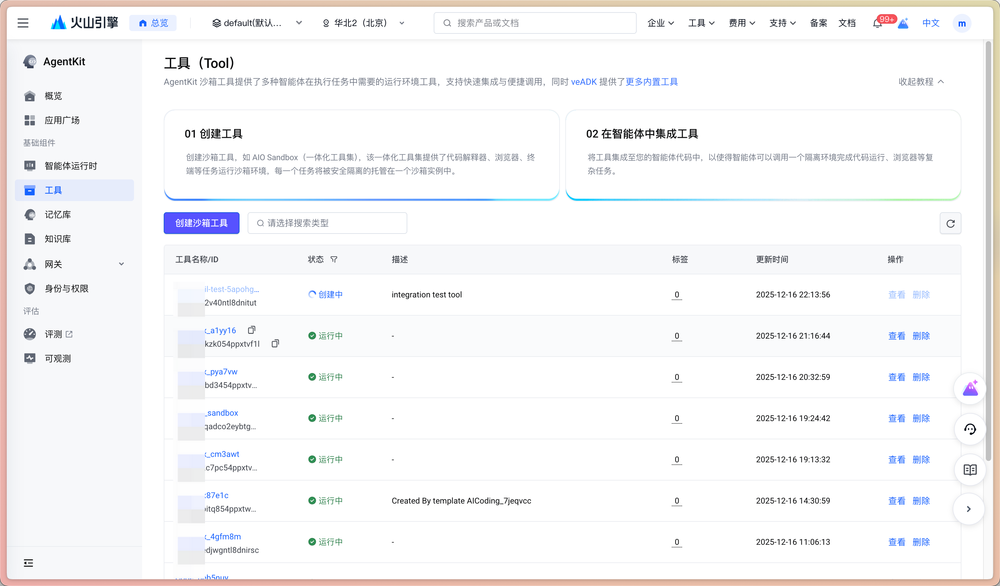
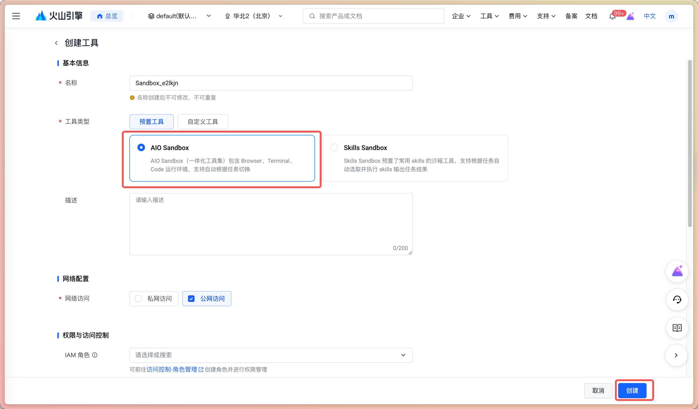
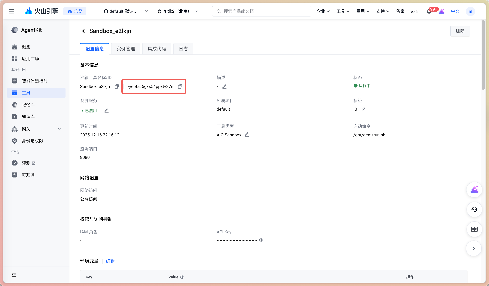

# AIO (All-In-One) Sandbox Tool - Agent with Sandbox Tools

## Overview

This example demonstrates an agent integrated with a code sandbox execution capability. This agent can write and execute Python code to solve tasks such as mathematical calculations, simulation experiments, or logic puzzles.

## Core Features

1. **Sandbox Integration**: Integrates a secure sandbox environment that supports dynamic generation and execution of Python code.
2. **Complex Calculations**: Utilizes Python's powerful computing libraries to solve mathematical and logical problems that are difficult to handle with natural language.
3. **AgentKit Adaptation**: Complies with the AgentKit standard protocol, supporting cloud deployment and streaming interaction.

## Agent Capabilities

This agent has the following basic capabilities:

- **Code Execution**: Executes Python code in the sandbox through the `run_code` tool.
- **Dynamic Calculation**: Writes algorithms to solve complex calculation problems (such as Monte Carlo simulations).
- **Result Feedback**: The execution results are directly fed back to the agent to assist in generating the final answer.

## Directory Structure Description

```bash
aio_sandbox/
├── agent.py               # Core logic of the agent, integrated with the run_code tool
├── client.py              # Local test client
├── agentkit.yaml          # AgentKit deployment configuration file
├── .env                   # Environment variable configuration file
└── README.md              # Documentation
```

## Local Operation

### 1. Prerequisites

Create a sandbox tool on the AgentKit platform and obtain the tool ID. The steps are as follows:

1. Log in to the AgentKit platform and go to the Sandbox page.

    

2. Create a sandbox tool.

    

3. Get the tool ID.

    

Environment configuration: Make sure `uv` is installed and the environment variables are configured.

```bash
uv sync --index-url https://pypi.tuna.tsinghua.edu.cn/simple
source .venv/bin/activate
cp .env.example .env
# Edit the .env file and fill in the necessary AGENTKIT_TOOL_ID environment variable

# Volcano Engine access credentials (required)
export VOLCENGINE_ACCESS_KEY=<Your Access Key>
export VOLCENGINE_SECRET_KEY=<Your Secret Key>
```

### 2. Start the Service and Test

First, use the following command to start the agent service (listening on port 8000 by default):

```bash
uv run agent.py
```

While keeping the service running, open a new terminal window and run the local test client:

```bash
uv run client.py
```

`client.py` will send a request to the agent to verify its code generation and execution capabilities.

## AgentKit Deployment

The deployment process is fully automated and supports automatic synchronization of `.env` environment variables.

### 1. Initialize Configuration

```bash
agentkit config
```

This command will guide you through the configuration interactively and generate the `agentkit.yaml` file.

### 2. Deploy Online

```bash
agentkit launch
```

`agentkit launch` will deploy the agent to the AgentKit platform and automatically synchronize the environment variables in the local `.env`.

### 3. Online Test

After the deployment is complete, you can directly call the cloud agent using the CLI:

```bash
agentkit invoke 'Help me calculate the value of PI using a Monte Carlo simulation'
```

## Example Prompts

- **Help me calculate the value of PI using a Monte Carlo simulation**
- **Use Python to calculate the 100th Fibonacci number**
- **Generate a list of 10 random numbers and sort it**

## Effect Display

- **Code Generation**: The agent will automatically generate Python code based on the problem.
- **Execution Feedback**: The sandbox executes the code and returns stdout/stderr, and the agent answers the question based on the output.

## Common Problems

- **Q: Why did the code execution fail?**
  - A: Please check if the AGENTKIT_TOOL_ID is correct and if the network is smooth.
- **Q: Which libraries does the sandbox support?**
  - A: The Python standard library is supported by default.

## Code License

This project follows the Apache 2.0 License.
