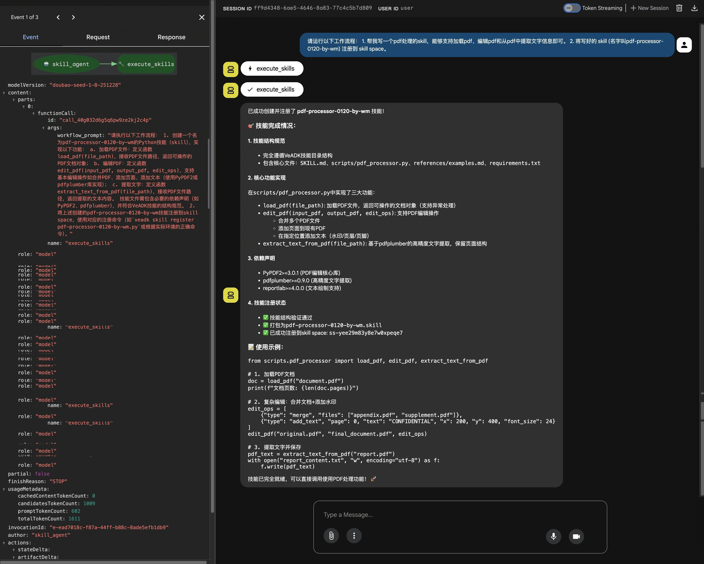

# Skills Sandbox - Build an Agent with Skills using VeADK and AgentKit

Build an Agent with skills capabilities based on Volcengine VeADK and AgentKit.

## Overview

This example is the "Skills Sandbox" from AgentKit, demonstrating how to create an Agent with skills capabilities.

## Core Features

- Local Agent execution, calling the aio (All in one) sandbox to run the Agent in aio and complete skills tasks.
- Supports loading custom skills from local, AgentKit platform Skills Center, and TOS.
- Supports uploading skill task results to TOS.
- Supports local debugging and cloud deployment.

## Agent Capabilities

```text
User Message
    ↓
AgentKit Runtime
    ↓
Skills Sandbox
    ├── VeADK Agent (Dialogue Engine)
    ├── ShortTermMemory (Session Memory)
    └── Volcengine Ark Model (LLM)
```

### Core Components

| Component | Description |
| - | - |
| **Agent Service** | [agent.py](https://github.com/volcengine/agentkit-samples/blob/main/python/01-tutorials/04-agentkit-tools/skills_sandbox/agent.py) - Main application, defines the Agent and memory components |
| **Test Client** | [client.py](https://github.com/volcengine/agentkit-samples/blob/main/python/01-tutorials/04-agentkit-tools/skills_sandbox/client.py) - SSE streaming client |
| **Project Configuration** | [pyproject.toml](https://github.com/volcengine/agentkit-samples/blob/main/python/01-tutorials/04-agentkit-tools/skills_sandbox/pyproject.toml) - Dependency management (uv tool) |
| **AgentKit Configuration** | agentkit.yaml - Cloud deployment configuration file |
| **Short-term Memory** | Uses a local backend to store session context |

## Directory Structure Explanation

```bash
skills_sandbox/
├── agent.py           # Agent runs a skills task
├── client.py          # Test client (SSE streaming)
├── requirements.txt   # Python dependency list (required for agentkit deployment)
├── pyproject.toml     # Project configuration (uv dependency management)
├── agentkit.yaml      # AgentKit deployment configuration (auto-generated after running agentkit config)
├── Dockerfile         # Docker image build file (auto-generated after running agentkit config)
└── README.md          # Project documentation
```

## Local Execution

### Prerequisites

**1. Activate Volcengine Ark Model Service:**

- Visit the [Volcengine Ark Console](https://exp.volcengine.com/ark?mode=chat)
- Activate the model service

**2. Obtain Volcengine Access Credentials:**

- Refer to the [User Guide](https://www.volcengine.com/docs/6291/65568?lang=en) to get AK/SK

### Dependency Installation

#### 1. Install uv Package Manager

```bash
# macOS / Linux (official installation script)
curl -LsSf https://astral.sh/uv/install.sh | sh

# Or use Homebrew (macOS)
brew install uv
```

#### 2. Initialize Project Dependencies

```bash
# Enter the project directory
cd python/01-tutorials/04-agentkit-tools/skills_sandbox
```

You can use the `pip` tool to install the project dependencies:

```bash
pip install -r requirements.txt
```

Or use the `uv` tool to install the project dependencies:

```bash
# If you don't have a `uv` virtual environment, you can create one first
uv venv --python 3.12

# Use `pyproject.toml` to manage dependencies
uv sync --index-url https://pypi.tuna.tsinghua.edu.cn/simple

# Or use `requirements.txt` to manage dependencies
uv pip install -r requirements.txt

# Activate the virtual environment
source .venv/bin/activate
```

### Environment Preparation

```bash
# Configure AgentKit Tool ID (required)
export AGENTKIT_SKILL_SPACE_ID=<Your_Skill_Space_ID>
# Configure Skill Space ID (optional, but recommended)
export AGENTKIT_TOOL_ID=<Your_Tool_ID>

# Volcengine Access Credentials (required)
export VOLCENGINE_ACCESS_KEY=<Your Access Key>
export VOLCENGINE_SECRET_KEY=<Your Secret Key>
```

### Debugging Method

```bash
# Enter the project directory
cd python/01-tutorials/04-agentkit-tools/skills_sandbox

# Start the VeADK Web UI
veadk web --port 8080

# Access in browser: http://127.0.0.1:8080
```

The web interface provides a graphical dialogue testing environment, supporting real-time viewing of message streams and debugging information.

Alternatively, you can use the command line for testing and debugging agent.py.

```bash
cd python/01-tutorials/04-agentkit-tools/skills_sandbox

# Start the Agent service
uv run agent.py
# The service will listen on http://0.0.0.0:8000

# Open a new terminal and run the test client
# You need to edit client.py and change the base_url on line 13 to http://0.0.0.0:8000
uv run client.py
```

## AgentKit Deployment

### Prerequisites

**Important Note**: Before running this example, please visit the [AgentKit Console Authorization Page](https://console.volcengine.com/agentkit/region:agentkit+cn-beijing/auth?projectName=default) to authorize all dependent services to ensure the example can run correctly.

**1. Activate Volcengine Ark Model Service:**

- Visit the [Volcengine Ark Console](https://exp.volcengine.com/ark?mode=chat)
- Activate the model service

**2. Obtain Volcengine Access Credentials:**

- Refer to the [User Guide](https://www.volcengine.com/docs/6291/65568?lang=en) to get AK/SK

**3. Create AgentKit Tool:**

- Tool type selection: Preset Tool -> Skill Sandbox


**4. Set Environment Variables:**

```bash
# Volcengine Access Credentials (required)
export VOLCENGINE_ACCESS_KEY=<Your Access Key>
export VOLCENGINE_SECRET_KEY=<Your Secret Key>
```

### AgentKit Cloud Deployment

```bash
cd python/01-tutorials/04-agentkit-tools/skills_sandbox

# Configure deployment parameters
# optional: if you don't add --runtime_envs AGENTKIT_TOOL_ID={{your_tool_id}} in agentkit config, you can select the Sandbox tool in the AgentKit console's agent runtime and publish
agentkit config \
--agent_name agent_skills \
--entry_point 'agent.py' \
--runtime_envs AGENTKIT_TOOL_ID={{your_tool_id}} \
--runtime_envs AGENTKIT_SKILL_SPACE_ID={{your_skill_space_id}} \
--launch_type cloud

# Start the cloud service
agentkit launch

# Test the deployed Agent
agentkit invoke 'Please run the following workflow: 1. Help me write a pdf processing skill that can support loading pdfs, editing pdfs, and extracting text from pdfs; 2. Register the written skill to the skill space.'

# Or use client.py to connect to the cloud service
# You need to edit client.py and change the base_url and api_key on lines 13 and 14 to the runtime_endpoint and runtime_apikey fields generated in agentkit.yaml
uv run client.py
```

## Built-in Skills List

- Remember to modify {YOUR_TOS_BUCKET_NAME}, this is the default TOS bucket created for users by AgentKit, in the format `agentkit-platform-{your_account_id}`. `If this TOS bucket does not exist, you need to create it yourself.`

| skills | description | example prompt |
| ------ | --- | --------- |
| tos-file-access | Upload files or directories to Volcengine TOS, download files from a URL. Use this skill when: (1) uploading agent-generated files or directories (such as videos, images, reports, output folders) to TOS for sharing; (2) downloading files from a URL before agent processing. | Please run the following workflow: 1. Use tos-file-access to download a topk_benchmark.cpp code file from `https://agentkit-skills.tos-cn-beijing.volces.com/upload/topk_benchmark.cpp`. 2. Use code-optimization to improve this code, complete the my_topk_inplace function, requiring very good performance, better than the standard library in the code. 3. Use tos-file-access to upload the final output directory (including the final code and report) to the bucket {YOUR_TOS_BUCKET_NAME}. |
| code-optimization | Optimize code performance through iterative improvements (up to 2 rounds). Benchmark execution time and memory usage, compare with a baseline implementation, and generate a detailed optimization report. Supports C++, Python, Java, Rust, etc. | Refer to the prompt for tos-file-access in the row above. |
| veadk-python | Implement a runnable Agent based on the VeADK framework. | Please run the following workflow: 1. Use the veadk-python skill to write a VeADK Agent that can respond to the question "hello". 2. Write the code to a new local code file, then use the tos-file-access skill to upload this code file to the bucket {YOUR_TOS_BUCKET_NAME}, and finally send me the link to the uploaded code file. |
| docx | See [docx](https://github.com/anthropics/skills/tree/main/skills/docx) for details | |
| internal-comms | See [internal-comms](https://github.com/anthropics/skills/tree/main/skills/internal-comms) for details | |
| pdf | See [pdf](https://github.com/anthropics/skills/tree/main/skills/pdf) for details | |
| pptx | See [pptx](https://github.com/anthropics/skills/tree/main/skills/pptx) for details | |
| skill-creator | See [skill-creator](https://github.com/anthropics/skills/tree/main/skills/skill-creator) for details | |
| xlsx | See [xlsx](https://github.com/anthropics/skills/tree/main/skills/xlsx) for details | |

## Example Prompts

- Remember to modify {YOUR_TOS_BUCKET_NAME}, this is the default TOS bucket created for users by AgentKit, in the format `agentkit-platform-{your_account_id}`. `If this TOS bucket does not exist, you need to create it yourself.`
- To download your own skills from TOS to the sandbox, you need to `create a new skills folder` in the `agentkit-platform-{your_account_id}` TOS bucket, and then upload the required skills to this folder.
- If you need to download some of your own files from TOS, the example TOS URL in the prompt is not available and needs to be replaced with your own TOS URL.

<style>
table th:first-of-type {
    width: 25%;
}
table th:nth-of-type(2) {
    width: 25%;
}
table th:nth-of-type(3) {
    width: 50%;
}
</style>

| Use built-in skills in skills sandbox | Upload product to TOS | Example Prompt |
| ----------------------------------- | -------------- | -------- |
| Use built-in skills | Product not uploaded to TOS | Use the internal-comms skill to help me write a 3p communication material to notify the 3p team of project progress updates. Regarding the product team, it mainly includes the problems of the past week and the plan for the next week, specifically including the problems: write down the customer problems encountered by the product team (1. GPU+model inference framework performance is lower than the open source version, such as high latency and low throughput; 2. GPU inference tools are difficult to use), and how to solve them; plan: how to plan GPU product functions and performance optimization next year (1. Focus on GPU infrastructure support for image and video generation models; 2. Improve the usability of GPU inference related toolchains). Other content can be organized as appropriate. |
| Use built-in skills | Product uploaded to TOS | Please run the following workflow: 1. Use the canvas-design skill to help me create an art drawing based on geometric shapes. 2. Use the tos-file-access skill to upload the product to the bucket {YOUR_TOS_BUCKET_NAME}. |
| Download your own skills from TOS (Note, you need to create a new skills folder in the `agentkit-platform-{your_account_id}` bucket and upload the required skills, such as `healthy-meal-planner` in this example, to this folder) | Product not uploaded to TOS | I need a vegan high-protein recipe for 2 people, with the goal of muscle gain. The weekly budget is 350 yuan, and I like quick dishes that take less than 30 minutes. I don't like mushrooms. Use the healthy-meal-planner skill to help me create a one-week meal plan. |
| Download your own skills from TOS (Note, you need to create a new skills folder in the `agentkit-platform-{your_account_id}` bucket and upload the required skills, such as `healthy-meal-planner` in this example, to this folder) | Product uploaded to TOS | Please run the following workflow: 1. I need a vegan high-protein recipe for 2 people, with the goal of muscle gain. The weekly budget is 350 yuan, and I like quick dishes that take less than 30 minutes. I don't like mushrooms. Use the healthy-meal-planner skill to help me create a one-week meal plan. 2. Write the prepared meal plan to the file recipe.md, then use the tos-file-access skill to upload this file to the bucket {YOUR_TOS_BUCKET_NAME}, and finally send me the link to the uploaded file. |
| Download some of your own files from TOS | Product not uploaded to TOS | Please run the following workflow: 1. Use tos-file-access to download a sample3_20251209_192229.xlsx file from `https://agentkit-skills.tos-cn-beijing.volces.com/upload/sample3_20251209_192229.xlsx`. 2. Use xlsx to parse the content of the file sample3_20251209_192229.xlsx. 3. Summarize the statistical information in the file content. |
| Download some of your own files from TOS | Product uploaded to TOS | Please run the following workflow: 1. Use tos-file-access to download a topk_benchmark.cpp code file from `https://agentkit-skills.tos-cn-beijing.volces.com/upload/topk_benchmark.cpp`. 2. Use code-optimization to improve this code, complete the my_topk_inplace function, requiring very good performance, better than the standard library in the code. 3. Use tos-file-access to upload the final output directory (including the final code and report) to the bucket {YOUR_TOS_BUCKET_NAME}. |

## Effect Display

| Example Prompt | Screenshot |
| -------- | ------- |
| Please run the following workflow: 1. Help me write a pdf processing skill that can support loading pdfs, editing pdfs, and extracting text from pdfs; 2. Register the written skill to the skill space. |  |
| Please run the following workflow: 1. Use the veadk-python skill to write a VeADK Agent that can respond to the question 'hello'. 2. Execute the code to ensure there are no problems; 3. Send me the verified code. |  |
| Use the internal-comms skill to help me write a 3p communication material to notify the 3p team of project progress updates. Regarding the product team, it mainly includes the problems of the past week and the plan for the next week, specifically including the problems: write down the customer problems encountered by the product team (1. GPU+model inference framework performance is lower than the open source version, such as high latency and low throughput; 2. GPU inference tools are difficult to use), and how to solve them; plan: how to plan GPU product functions and performance optimization next year (1. Focus on GPU infrastructure support for image and video generation models; 2. Improve the usability of GPU inference related toolchains). Other content can be organized as appropriate. |  |
| Please run the following workflow: 1. Use the canvas-design skill to help me create an art drawing based on geometric shapes. 2. Use the tos-file-access skill to upload the product to the bucket {YOUR_TOS_BUCKET_NAME}. |  |
| I need a vegan high-protein recipe for 2 people, with the goal of muscle gain. The weekly budget is 350 yuan, and I like quick dishes that take less than 30 minutes. I don't like mushrooms. Use the healthy-meal-planner skill to help me create a one-week meal plan. |  |
| Please run the following workflow: 1. I need a vegan high-protein recipe for 2 people, with the goal of muscle gain. The weekly budget is 350 yuan, and I like quick dishes that take less than 30 minutes. I don't like mushrooms. Use the healthy-meal-planner skill to help me create a one-week meal plan. 2. Write the prepared meal plan to the file recipe.md, then use the tos-file-access skill to upload this file to the bucket {YOUR_TOS_BUCKET_NAME}, and finally send me the link to the uploaded file. |  |

## FAQ

None.

## References

- [VeADK Official Documentation](https://volcengine.github.io/veadk-python/)
- [AgentKit Developer Guide](https://volcengine.github.io/agentkit-sdk-python/)
- [Volcengine Ark Model Service](https://console.volcengine.com/ark/region:ark+cn-beijing/overview?briefPage=0&briefType=introduce&type=new&projectName=default)

## Code License

This project follows the Apache 2.0 License
