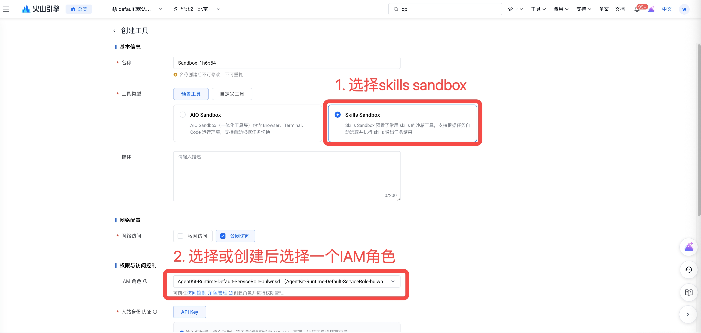
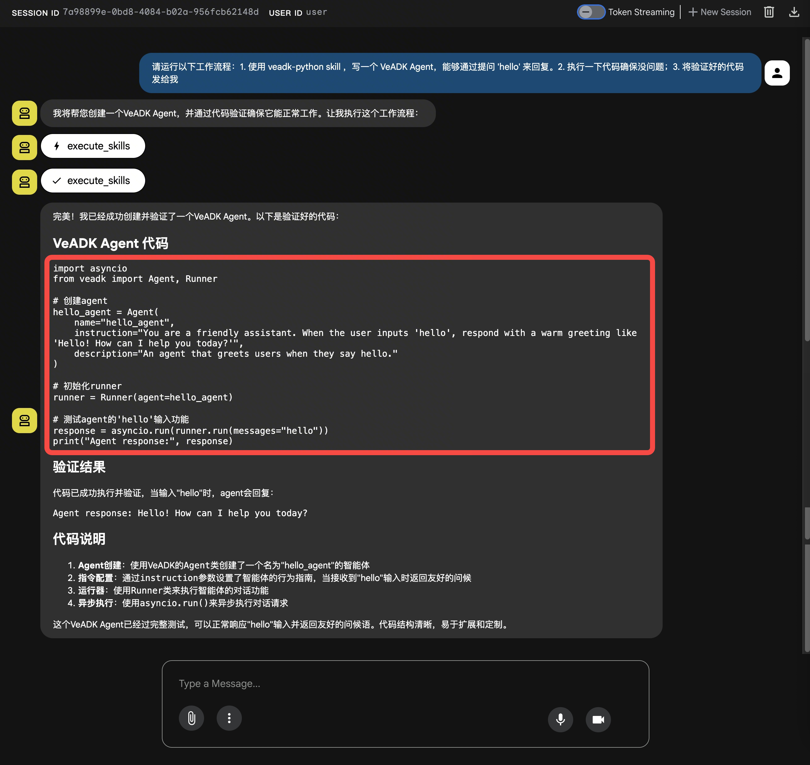
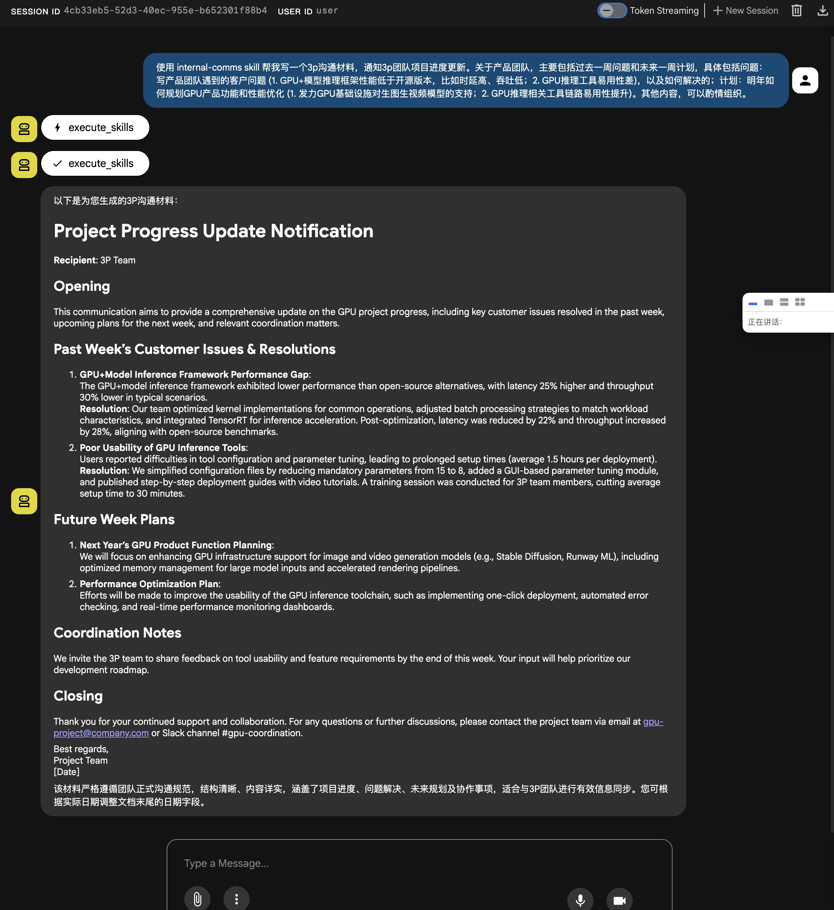
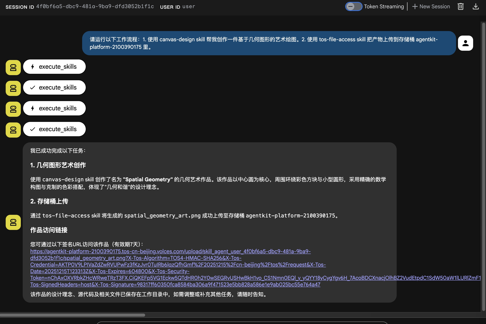
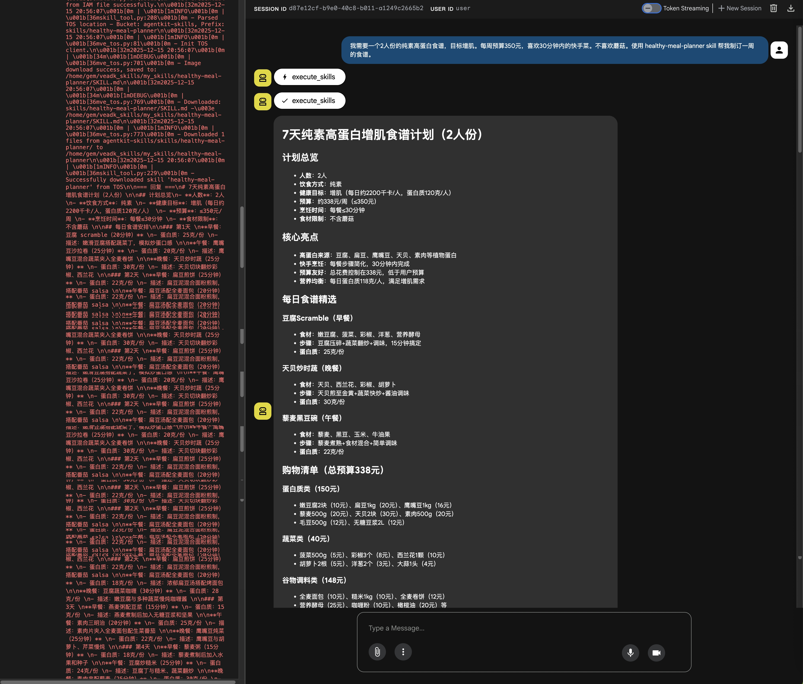
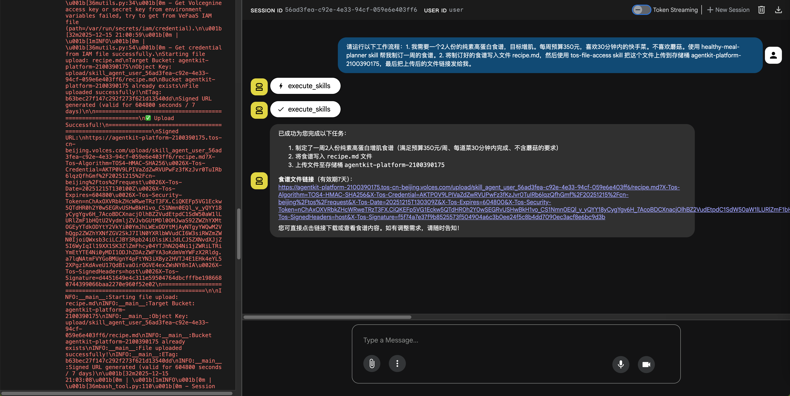

# Skills Sandbox - Building Agents with Skills using VeADK and AgentKit

Build Agents with skills capabilities based on Volcano Engine's VeADK and AgentKit.

## Overview

This example is AgentKit's "Skills Sandbox," demonstrating how to create an Agent with skills capabilities.

## Core Features

- Run a local Agent that calls an aio (All in one) sandbox to execute an Agent within it, completing skill-based tasks.
- Support for loading custom skills from TOS (TOS Object Service).
- Support for uploading skill task results to TOS.
- Supports both `single-threaded execution` (agent.py) and `multi-threaded concurrency` (parallel.py) modes.
- Supports local debugging and cloud deployment.

## Agent Capabilities

```text
User Message
    ↓
AgentKit Runtime
    ↓
Agent Skills
    ├── VeADK Agent (Dialogue Engine)
    ├── ShortTermMemory (Session Memory)
    └── Volcano Ark Model (LLM)
```

### Core Components

| Component | Description |
| - | - |
| **Agent Service** | [agent.py](https://github.com/volcengine/agentkit-samples/blob/main/python/01-tutorials/04-agentkit-tools/02_skills_sandbox/agent.py) - Main application, defines the Agent and memory components. |
| **Test Client** | [client.py](https://github.com/volcengine/agentkit-samples/blob/main/python/01-tutorials/04-agentkit-tools/02_skills_sandbox/client.py) - SSE streaming invocation client. |
| **Project Configuration** | [pyproject.toml](https://github.com/volcengine/agentkit-samples/blob/main/python/01-tutorials/04-agentkit-tools/02_skills_sandbox/pyproject.toml) - Dependency management (uv tool). |
| **AgentKit Configuration** | agentkit.yaml - Cloud deployment configuration file. |
| **Short-term Memory** | Uses a local backend to store session context. |

### Code Features

**Agent Definition** ([agent.py](https://github.com/volcengine/agentkit-samples/blob/main/python/01-tutorials/04-agentkit-tools/02_skills_sandbox/agent.py#L11-L15)):

```python
agent = Agent()
short_term_memory = ShortTermMemory(backend="local")

runner = Runner(
    agent=agent,
    short_term_memory=short_term_memory,
    app_name=app_name,
    user_id=user_id
)
```

## Directory Structure

```bash
skills_sandbox/
├── agent.py           # Agent runs a single skill task
├── parallel.py        # Concurrently runs multiple skill tasks
├── client.py          # Test client (SSE streaming invocation)
├── requirements.txt   # Python dependency list (required for AgentKit deployment)
├── pyproject.toml     # Project configuration (uv dependency management)
├── agentkit.yaml      # AgentKit deployment configuration (auto-generated after running agentkit config)
├── Dockerfile         # Docker image build file (auto-generated after running agentkit config)
└── README.md          # Project documentation
```

## Local Execution

### Prerequisites

**1. Activate Volcano Ark Model Service:**

- Visit [Volcano Ark Console](https://exp.volcengine.com/ark?mode=chat)
- Activate the model service

**2. Obtain Volcano Engine Access Credentials:**

- Refer to the [User Guide](https://www.volcengine.com/docs/6291/65568?lang=en) to get your AK/SK.

### Dependency Installation

#### 1. Install the uv Package Manager

```bash
# macOS / Linux (official installation script)
curl -LsSf https://astral.sh/uv/install.sh | sh

# Or use Homebrew (macOS)
brew install uv
```

#### 2. Initialize Project Dependencies

```bash
# Navigate to the project directory
cd python/01-tutorials/04-agentkit-tools/02_skills_sandbox
```

You can install the project dependencies using `pip`:

```bash
pip install -r requirements.txt
```

Or use the `uv` tool:

```bash
# If you don't have a uv virtual environment, create one first
uv venv --python 3.12

# Use pyproject.toml to manage dependencies
uv sync --index-url https://pypi.tuna.tsinghua.edu.cn/simple

# Or use requirements.txt
uv pip install -r requirements.txt

# Activate the virtual environment
source .venv/bin/activate
```

### Environment Setup

```bash
# Volcano Ark model name
export MODEL_AGENT_NAME=doubao-seed-1-6-251015

# Volcano Engine access credentials (required)
export VOLCENGINE_ACCESS_KEY=<Your Access Key>
export VOLCENGINE_SECRET_KEY=<Your Secret Key>

export AGENTKIT_TOOL_ID=<Your Tool ID>
```

### Debugging Methods

#### Single-threaded execution: Use the VeADK Web UI to debug agent.py

```bash
# Navigate to the project directory
cd python/01-tutorials/04-agentkit-tools/02_skills_sandbox

# Start the VeADK Web UI
veadk web --port 8080

# Access in your browser: http://127.0.0.1:8080
```

The web interface provides a graphical chat environment for testing, with real-time message flow and debugging information.

Alternatively, you can use the command line for testing and debugging `agent.py`.

```bash
cd python/01-tutorials/04-agentkit-tools/02_skills_sandbox

# Start the Agent service
uv run agent.py
# The service will listen on http://0.0.0.0:8000

# Open a new terminal and run the test client
# You will need to edit client.py, changing the base_url to http://0.0.0.0:8000
uv run client.py
```

#### Multi-threaded concurrency: Use the command line to debug parallel.py

```bash
cd python/01-tutorials/04-agentkit-tools/02_skills_sandbox

# Run the multi-threaded concurrent program
uv run parallel.py
```

## AgentKit Deployment

### Prerequisites

**Important**: Before running this example, please visit the [AgentKit Console Authorization Page](https://console.volcengine.com/agentkit/region:agentkit+cn-beijing/auth?projectName=default) to authorize all dependent services.

**1. Activate Volcano Ark Model Service:**

- Visit the [Volcano Ark Console](https://exp.volcengine.com/ark?mode=chat)
- Activate the model service

**2. Obtain Volcano Engine Access Credentials:**

- Refer to the [User Guide](https://www.volcengine.com/docs/6291/65568?lang=en) to get your AK/SK.

**3. Create an AgentKit Tool:**

- Select Tool Type: Pre-built Tools -> Skill Sandbox



**4. Set Environment Variables:**

```bash
# Volcano Engine access credentials (required)
export VOLCENGINE_ACCESS_KEY=<Your Access Key>
export VOLCENGINE_SECRET_KEY=<Your Secret Key>
```

### AgentKit Cloud Deployment

```bash
cd python/01-tutorials/04-agentkit-tools/02_skills_sandbox

# Configure deployment parameters
# Optional: If you don't add --runtime_envs AGENTKIT_TOOL_ID={{your_tool_id}} in the agentkit config command, you can select the Sandbox Tool in the AgentKit console under the agent's runtime, then publish.
agentkit config \
--agent_name agent_skills \
--entry_point 'agent.py' \
--runtime_envs AGENTKIT_TOOL_ID={{your_tool_id}} \
--launch_type cloud

# Launch the cloud service
agentkit launch

# Test the deployed Agent
agentkit invoke 'Use the internal-comms skill to help me write a 3p communication material to notify the 3p team of project progress updates. For the product team, it should mainly include issues from the past week and plans for the next week. Specifically, the issues are: customer problems encountered by the product team (1. GPU + model inference framework performance is lower than open-source versions, e.g., high latency, low throughput; 2. Poor usability of GPU inference tools), and how they were resolved. The plans are: how to plan GPU product features and performance optimization for next year (1. Focus on GPU infrastructure support for image and video generation models; 2. Improve the usability of the GPU inference toolchain). Other content can be organized as appropriate.'

# Or use client.py to connect to the cloud service
# You will need to edit client.py, changing the base_url and api_key on lines 14 and 15 to the runtime_endpoint and runtime_apikey generated in agentkit.yaml
uv run client.py
```

## Built-in Skills List

- Remember to modify `{YOUR_TOS_BUCKET_NAME}`. This is the default TOS bucket created for the user by AgentKit, in the format `agentkit-platform-{your_account_id}`. `If this TOS bucket does not exist, you need to create it yourself.`

| Skill | Description | Example Prompt |
| ------ | --- | --------- |
| tos-file-access | Uploads files or directories to Volcano Engine TOS, downloads files from a URL. Use this skill when: (1) Uploading agent-generated files or directories (like videos, images, reports, output folders) to TOS for sharing; (2) Downloading files from a URL before agent processing. | Please run the following workflow: 1. Use tos-file-access to download a `topk_benchmark.cpp` code file from `https://agentkit-skills.tos-cn-beijing.volces.com/upload/topk_benchmark.cpp`. 2. Use code-optimization to perfect this code, complete the `my_topk_inplace` function, requiring very high performance, better than the standard library in the code. 3. Use tos-file-access to upload the final output directory (including the final code and report) to the bucket {YOUR_TOS_BUCKET_NAME}. |
| code-optimization | Optimizes code performance through iterative improvements (up to 2 rounds). Benchmarks execution time and memory usage, compares against a baseline implementation, and generates a detailed optimization report. Supports languages like C++, Python, Java, Rust. | Refer to the prompt for tos-file-access in the row above. |
| veadk-python | Implements a runnable Agent based on the VeADK framework. | Please run the following workflow: 1. Use the veadk-python skill to write a VeADK Agent that can reply to the question "hello". 2. Write the code into a new local code file, then use the tos-file-access skill to upload this code file to the bucket {YOUR_TOS_BUCKET_NAME}, and finally send me the link to the uploaded code file. |
| algorithmic-art | See [algorithmic-art](https://github.com/anthropics/skills/tree/main/skills/algorithmic-art) for details. | |
| brand-guidelines | See [brand-guidelines](https://github.com/anthropics/skills/tree/main/skills/brand-guidelines) for details. | |
| canvas-design | See [canvas-design](https://github.com/anthropics/skills/tree/main/skills/canvas-design) for details. | |
| doc-coauthoring | See [doc-coauthoring](https://github.com/anthropics/skills/tree/main/skills/doc-coauthoring) for details. | |
| docx | See [docx](https://github.com/anthropics/skills/tree/main/skills/docx) for details. | |
| frontend-design | See [frontend-design](https://github.com/anthropics/skills/tree/main/skills/frontend-design) for details. | |
| internal-comms | See [internal-comms](https://github.com/anthropics/skills/tree/main/skills/internal-comms) for details. | |
| mcp-builder | See [mcp-builder](https://github.com/anthropics/skills/tree/main/skills/mcp-builder) for details. | |
| pdf | See [pdf](https://github.com/anthropics/skills/tree/main/skills/pdf) for details. | |
| pptx | See [pptx](https://github.com/anthropics/skills/tree/main/skills/pptx) for details. | |
| skill-creator | See [skill-creator](https://github.com/anthropics/skills/tree/main/skills/skill-creator) for details. | |
| slack-gif-creator | See [slack-gif-creator](https://github.com/anthropics/skills/tree/main/skills/slack-gif-creator) for details. | |
| theme-factory | See [theme-factory](https://github.com/anthropics/skills/tree/main/skills/theme-factory) for details. | |
| web-artifacts-builder | See [web-artifacts-builder](https://github.com/anthropics/skills/tree/main/skills/web-artifacts-builder) for details. | |
| webapp-testing | See [webapp-testing](https://github.com/anthropics/skills/tree/main/skills/webapp-testing) for details. | |
| xlsx | See [xlsx](https://github.com/anthropics/skills/tree/main/skills/xlsx) for details. | |

## Example Prompts

- Remember to modify `{YOUR_TOS_BUCKET_NAME}`. This is the default TOS bucket created for the user by AgentKit, in the format `agentkit-platform-{your_account_id}`. `If this TOS bucket does not exist, you need to create it yourself.`
- To download your own skills from TOS into the sandbox, you need to `create a new skills folder` in the `agentkit-platform-{your_account_id}` TOS bucket, and then upload the required skills to this folder.
- If you need to download some of your own files from TOS, the example TOS URL in the prompt is not available and needs to be replaced with your own TOS URL.

<style>
table th:first-of-type {
    width: 25%;
}
table th:nth-of-type(2) {
    width: 25%;
}
table th:nth-of-type(3) {
    width: 50%;
}
</style>

| Use built-in skills sandbox | Upload product to TOS | Example Prompt |
| ----------------------------------- | -------------- | -------- |
| Use built-in skills | Product not uploaded to TOS | Use the internal-comms skill to help me write a 3p communication material to notify the 3p team of project progress updates. For the product team, it should mainly include issues from the past week and plans for the next week. Specifically, the issues are: customer problems encountered by the product team (1. GPU + model inference framework performance is lower than open-source versions, e.g., high latency, low throughput; 2. Poor usability of GPU inference tools), and how they were resolved. The plans are: how to plan GPU product features and performance optimization for next year (1. Focus on GPU infrastructure support for image and video generation models; 2. Improve the usability of the GPU inference toolchain). Other content can be organized as appropriate. |
| Use built-in skills | Product uploaded to TOS | Please run the following workflow: 1. Use the canvas-design skill to help me create an art drawing based on geometric shapes. 2. Use the tos-file-access skill to upload the product to the bucket {YOUR_TOS_BUCKET_NAME}. |
| Download your own skills from TOS (Note, you need to create a new skills folder in your `agentkit-platform-{your_account_id}` bucket and upload the required skills, like `healthy-meal-planner` in this example, to this folder) | Product not uploaded to TOS | I need a vegan, high-protein recipe for 2 people, aiming for muscle gain. The weekly budget is 350 yuan, and I prefer quick meals that take less than 30 minutes. I don't like mushrooms. Use the healthy-meal-planner skill to help me create a one-week meal plan. |
| Download your own skills from TOS (Note, you need to create a new skills folder in your `agentkit-platform-{your_account_id}` bucket and upload the required skills, like `healthy-meal-planner` in this example, to this folder) | Product uploaded to TOS | Please run the following workflow: 1. I need a vegan, high-protein recipe for 2 people, aiming for muscle gain. The weekly budget is 350 yuan, and I prefer quick meals that take less than 30 minutes. I don't like mushrooms. Use the healthy-meal-planner skill to help me create a one-week meal plan. 2. Write the prepared meal plan into a file recipe.md, then use the tos-file-access skill to upload this file to the bucket {YOUR_TOS_BUCKET_NAME}, and finally send me the link to the uploaded file. |
| Download some of your own files from TOS | Product not uploaded to TOS | Please run the following workflow: 1. Use tos-file-access to download a `sample3_20251209_192229.xlsx` file from `https://agentkit-skills.tos-cn-beijing.volces.com/upload/sample3_20251209_192229.xlsx`. 2. Use xlsx to parse the content of the file `sample3_20251209_192229.xlsx`. 3. Summarize the statistical information in the file content. |
| Download some of your own files from TOS | Product uploaded to TOS | Please run the following workflow: 1. Use tos-file-access to download a `topk_benchmark.cpp` code file from `https://agentkit-skills.tos-cn-beijing.volces.com/upload/topk_benchmark.cpp`. 2. Use code-optimization to perfect this code, complete the `my_topk_inplace` function, requiring very high performance, better than the standard library in the code. 3. Use tos-file-access to upload the final output directory (including the final code and report) to the bucket {YOUR_TOS_BUCKET_NAME}. |

## Demonstration

| Example Prompt | Screenshot |
| -------- | ------- |
| Please run the following workflow: 1. Use the veadk-python skill to write a VeADK Agent that can reply to the question 'hello'. 2. Execute the code to ensure there are no problems; 3. Send me the validated code. |  |
| Use the internal-comms skill to help me write a 3p communication material to notify the 3p team of project progress updates. For the product team, it should mainly include issues from the past week and plans for the next week. Specifically, the issues are: customer problems encountered by the product team (1. GPU + model inference framework performance is lower than open-source versions, e.g., high latency, low throughput; 2. Poor usability of GPU inference tools), and how they were resolved. The plans are: how to plan GPU product features and performance optimization for next year (1. Focus on GPU infrastructure support for image and video generation models; 2. Improve the usability of the GPU inference toolchain). Other content can be organized as appropriate. |  |
| Please run the following workflow: 1. Use the canvas-design skill to help me create an art drawing based on geometric shapes. 2. Use the tos-file-access skill to upload the product to the bucket {YOUR_TOS_BUCKET_NAME}. |  |
| I need a vegan, high-protein recipe for 2 people, aiming for muscle gain. The weekly budget is 350 yuan, and I prefer quick meals that take less than 30 minutes. I don't like mushrooms. Use the healthy-meal-planner skill to help me create a one-week meal plan. |  |
| Please run the following workflow: 1. I need a vegan, high-protein recipe for 2 people, aiming for muscle gain. The weekly budget is 350 yuan, and I prefer quick meals that take less than 30 minutes. I don't like mushrooms. Use the healthy-meal-planner skill to help me create a one-week meal plan. 2. Write the prepared meal plan into a file recipe.md, then use the tos-file-access skill to upload this file to the bucket {YOUR_TOS_BUCKET_NAME}, and finally send me the link to the uploaded file. |  |

## FAQ

None.

## References

- [VeADK Official Documentation](https://volcengine.github.io/veadk-python/)
- [AgentKit Development Guide](https://volcengine.github.io/agentkit-sdk-python/)
- [Volcano Ark Model Service](https://console.volcengine.com/ark/region:ark+cn-beijing/overview?briefPage=0&briefType=introduce&type=new&projectName=default)

## Code License

This project is licensed under the Apache 2.0 License.
