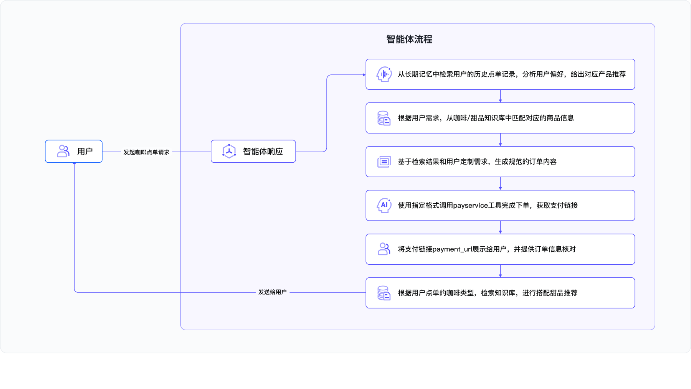
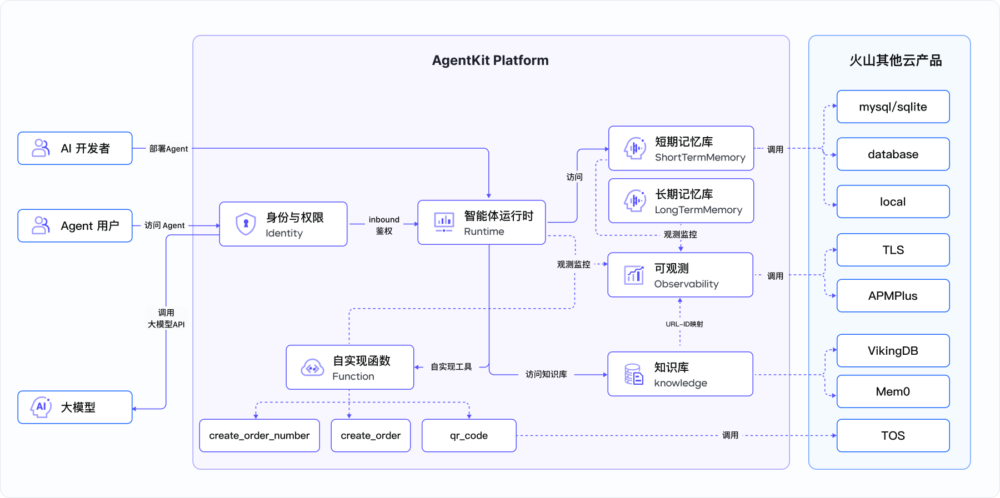
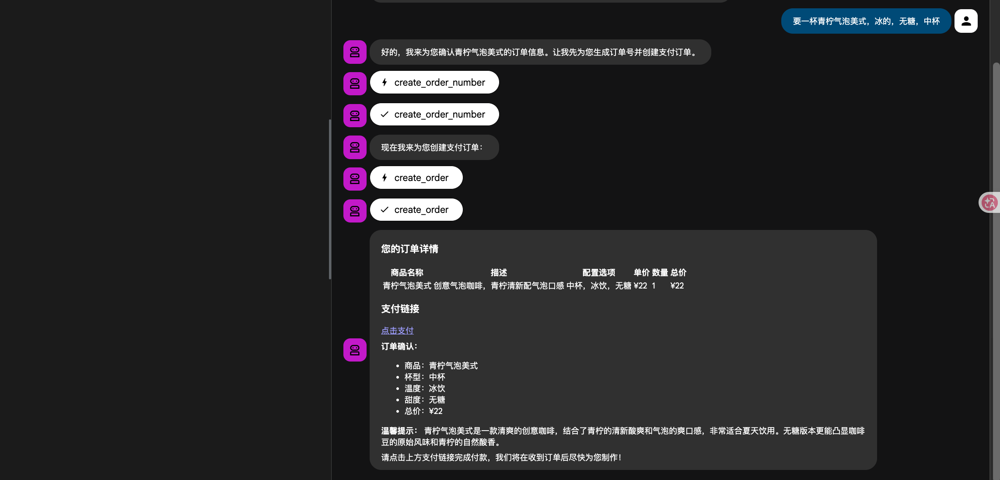
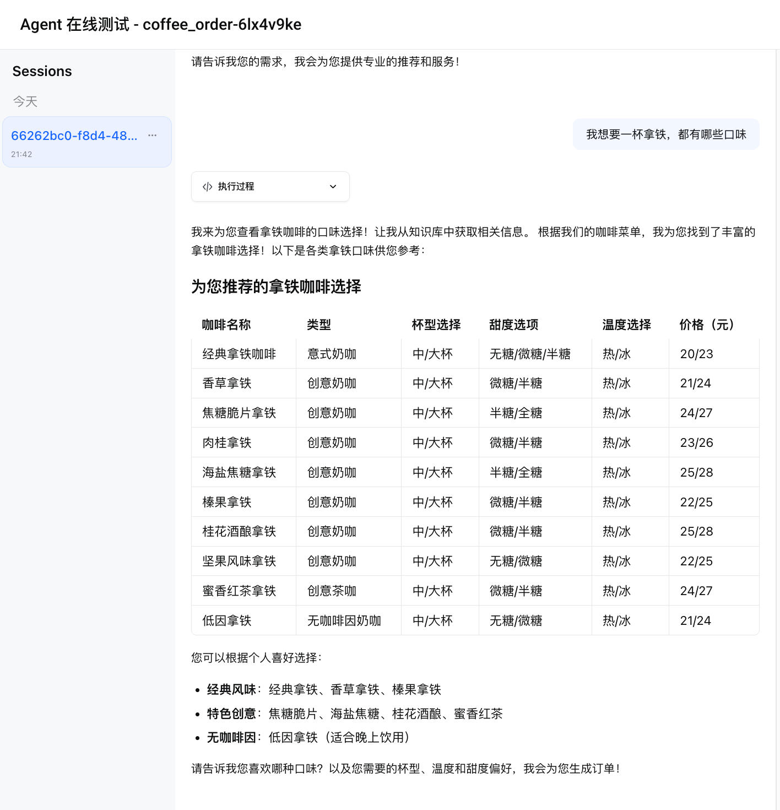

# Coffee Order Agent - 咖啡点单智能体

## 概述

本系统是一个基于VeADK开发框架和AgentKit平台构建的智能咖啡点单Agent。该智能体集成了一个模拟的订单创建工具，结合一个包含咖啡和甜品信息的知识库，以及长期和短期记忆组件，为用户提供个性化的点单推荐和订单创建服务。用户可以通过自然语言输入他们的口味偏好、饮品类型等信息，智能体将根据知识库中的产品信息进行推荐，并通过订单工具模拟订单创建流程。

## 核心功能

本用例构建了一个咖啡点单智能体，智能体将按照以下流程响应用户的下单请求：




## Agent能力

- **智能体运行时（主Agent）**：基于用户输入的口味偏好、饮品类型等信息，调用相应工具和能力，进行订单推荐和创建
- **订单创建工具**：模拟订单创建流程，用户可根据实际需求进行定制化开发
- **知识库**：维护一个包含咖啡和甜品信息的知识库，支持Agent进行信息检索和推荐
- **长期记忆**：持久化存储用户相关的历史对话信息，支持个性化推荐和用户画像构建
- **短期记忆**：维护对话上下文，支持连续对话和上下文理解




主要使用的火山引擎产品或 Agent 组件：

- 方舟大模型：
  - deepseek-v3-2-251201
- VikingDB 知识库
- VikingDB 记忆库
- TOS 存储服务
- AgentKit
- Identity
- APMPlus

## 目录结构说明

```bash
coffee_order/
├── README.md                  # 项目说明文档
├── __init__.py
├── agent.py                   # Agent应用入口
├── alipay_payment.html        # 模拟支付宝支付页面
├── alipay_payment.py          # 模拟支付宝支付服务
├── img
│   ├── arch.png               # 系统架构图
│   └── flow.png               # 智能体流程图
└── knowledge/                 # 知识库目录
    ├── coffe.md               # 咖啡产品信息
    └── sweet.md               # 甜品产品信息
├── mock_pay_service.py        # 模拟支付服务
├── pyproject.toml             # Python项目配置文件
├── qr_utils.py                # 二维码生成工具
├── requirements.txt           # Python依赖包
└── test_payment.py
```

## 本地运行

### 前置准备

**1. Python版本：**

- Python 3.12 或更高版本

**2. 开通火山方舟模型服务：**

- 访问 [火山方舟控制台](https://exp.volcengine.com/ark?mode=chat)
- 开通模型服务

**3. 获取火山引擎访问凭证：**

- 参考 [用户指南](https://www.volcengine.com/docs/6291/65568?lang=zh) 获取 AK/SK

**4. 创建或导入知识库：**

- 参考 [AgentKit 知识库指南](https://www.volcengine.com/docs/86681/1865671) 创建或导入知识库

**5. 创建或导入记忆库：**

- 参考 [AgentKit 创建记忆库](https://www.volcengine.com/docs/86681/1844843) 新建记忆库
- 参考 [AgentKit 导入记忆库](https://www.volcengine.com/docs/86681/2205109) 导入已有记忆库

### 依赖安装

```bash
# 克隆代码仓库
git clone https://github.com/volcengine/agentkit-samples.git
cd agentkit-samples/python/02-use-cases/coffee_order

# 安装项目依赖
uv sync --index-url https://pypi.tuna.tsinghua.edu.cn/simple
# 或者使用 pip 安装
uv pip install -r requirements.txt -i https://pypi.tuna.tsinghua.edu.cn/simple
```

### 环境准备

本地需要配置的环境变量

```bash
# 火山引擎aksk，用于创建agent runtime，以及调用火山引擎产品
export VOLCENGINE_ACCESS_KEY=<your_access_key>
export VOLCENGINE_SECRET_KEY=<your_secret_key>

# 火山tos相关环境变量（知识库上传、二维码生成过程，依赖tos存储）
export DATABASE_TOS_BUCKET=<your_tos_bucket_name>
export DATABASE_TOS_REGION=<your_tos_bucket_region>

# 知识库相关环境变量 (默认集成火山vikingDB作为知识库后端)
export DATABASE_VIKING_COLLECTION=<your_vikingdb_collection_name>

# 长期记忆相关环境变量（默认支持两种后端：VikingDB和Mem0，用户根据需要任选一种即可）
## 选择VikingDB作为长期记忆后端时需要配置以下环境变量
export DATABASE_VIKINGMEM_COLLECTION=<your_vikingdb_memory_collection_name>
export DATABASE_VIKINGMEM_MEMORY_TYPE=<your_vikingdb_memory_type>
## 选择Mem0作为长期记忆后端时需要配置以下环境变量
export DATABASE_MEM0_BASE_URL=<your_mem0_base_url>
export DATABASE_MEM0_API_KEY=<your_mem0_api_key>
```

### 调试方法
使用 `veadk web` 进行本地调试:
```bash
# 进入上一级目录
cd agentkit-samples/python/02-use-cases

# 启动 VeADK Web 界面
veadk web --port 8080

# 在浏览器访问：http://127.0.0.1:8080
```

## AgentKit 云裳部署

```bash
# 进入项目目录
cd agentkit-samples/python/02-use-cases/coffee_order

# 配置 AgentKit 部署配置
agentkit config \
--agent_name coffee_order \
--entry_point 'agent.py' \
--launch_type cloud

# 配置 AgentKit Runtime环境变量
agentkit config \
-e VOLCENGINE_ACCESS_KEY=<your_ak> \
-e VOLCENGINE_SECRET_KEY=<your_sk> \
-e DATABASE_TOS_BUCKET=<your_tos_bucket> \
-e DATABASE_TOS_REGION=<your_tos_region> \
-e DATABASE_VIKING_COLLECTION=<your_knowledgebase_backend_viking_name> \
-e DATABASE_VIKINGMEM_COLLECTION=<your_long_term_memory_backend_viking_name> \
-e DATABASE_VIKINGMEM_MEMORY_TYPE=<your_vikingmem_type>

# 启动云端打包编译 和 服务部署
agentkit launch

# 测试部署
agentkit invoke "你好"
```

## 示例提示词
```text
你好
我想要一杯拿铁，都有哪些口味？
点一杯肉桂拿铁，热的，中杯，微糖。
```

## 效果展示

### 本地veadk web




### Agentkit 控制台

在AgentKit控制台 智能体运行时 页面找到已部署的智能体 `coffee_order`，点击在线测评，进行测试。


