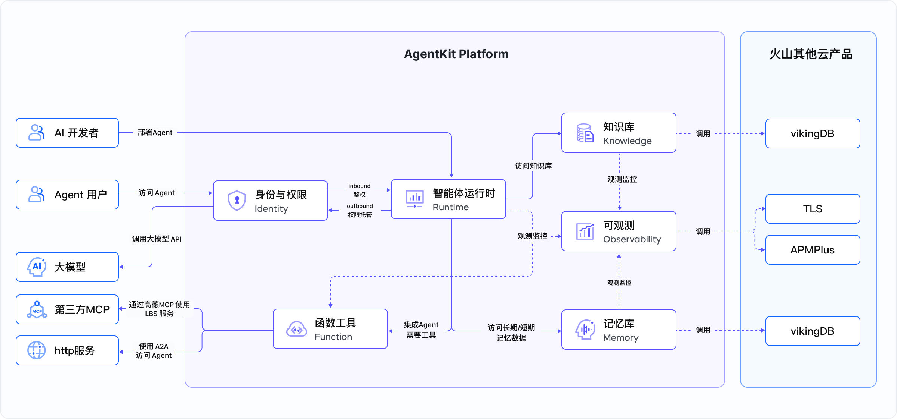
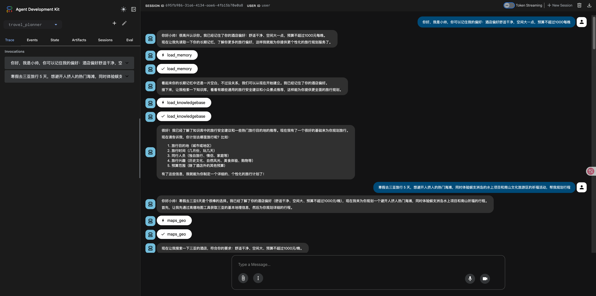
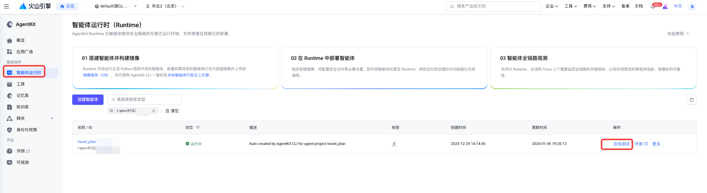
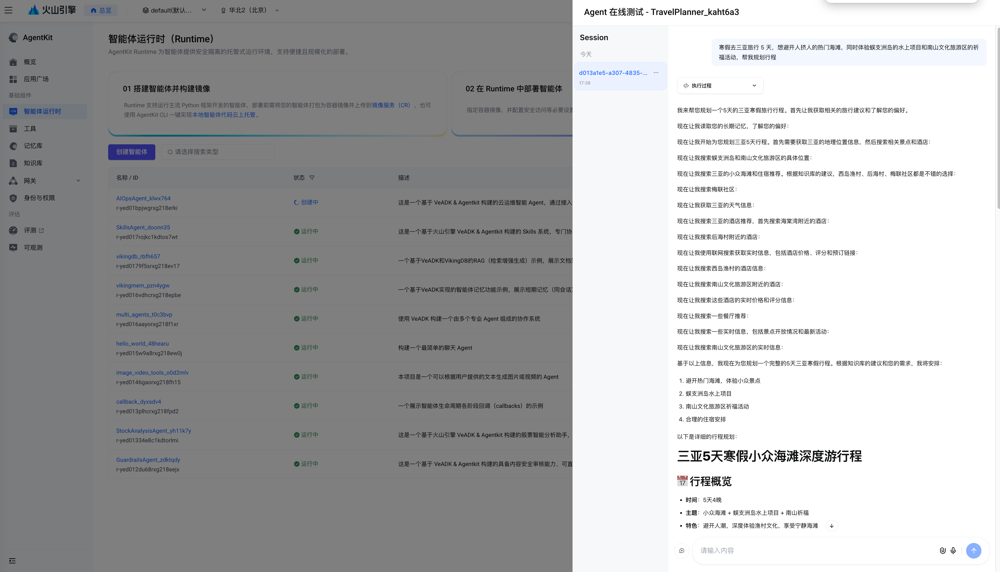
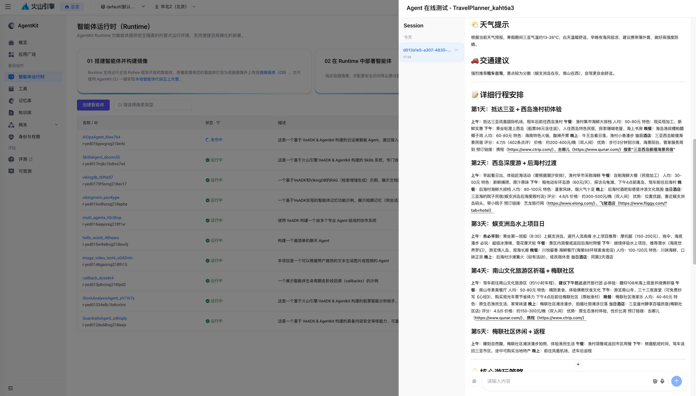

# Smart Travel Assistant

## Overview

This is a smart travel planning agent built based on the Volcano Engine VeADK & AgentKit. This agent integrates third-party MCP (Gaode) services to obtain LBS geographic location information and plan travel routes; has a built-in knowledge base built by VikingDB, which can provide general travel safety suggestions and niche attraction recommendations; accesses the Web Search basic online search tool to enhance the agent's real-time information search capabilities; and records user preferences through a memory base to provide users with a personalized service experience.

## Core Functions

This project provides the following core functions:

- **Itinerary Planning**: Calls the third-party MCP Tool (Gaode) to generate detailed itinerary arrangements, including transportation, dining, accommodation recommendations, and attraction tours.
- **Real-time Information Query**: Calls web search to query real-time information (such as weather, attraction opening hours, and ticket reservations) to ensure a smooth user journey.
- **Travel Knowledge Base**: Built-in travel-related knowledge base to provide niche attraction recommendations and practical travel suggestions.
- **Personalized Recommendations**: Provides personalized recommendations based on the user's historical preferences and travel habits recorded in the memory base.

## Agent Capabilities



```text
User Message
    ↓
AgentKit Runtime
    ↓
Travel Assistant Agent
    ├── Travel Knowledge Base
    ├── Long-term Memory Base
    ├── MCP Tool (Gaode)
    └── Web Search Tool
```

The main Volcano Engine products or Agent components are:

- Ark Large Model:
  - deepseek-v3-2-251201
- VikingDB Knowledge Base
- VikingDB Memory Base
- TOS Storage Service
- Web Search
- AgentKit
- Identity
- APMPlus

## Directory Structure Description

```bash
├── README.md # Project description
├── __init__.py # Initialization file
├── agent.py  # Agent application entry point
├── client.py # Agent client
├── knowledgebase_docs # Knowledge base documents
│   ├── tourists_recommend.md
│   └── general_safety_guide.md
└── requirements.txt  # List of dependent packages
```

## Local Operation

### Prerequisites

**Python Version:**

- Python 3.12 or higher

**1. Activate Volcano Ark Model Service:**

- Visit the [Volcano Ark Console](https://exp.volcengine.com/ark?mode=chat)
- Activate the model service

**2. Obtain Volcano Engine Access Credentials:**

- Refer to the [User Guide](https://www.volcengine.com/docs/6291/65568?lang=zh) to obtain AK/SK

**3. Obtain Gaode MCP Service Access Credentials:**

- Register and log in to the [Gaode Open Platform](https://lbs.amap.com/)
- Refer to [Create an Application and Get a Key](https://amap.apifox.cn/doc-537183) to obtain the Key for the Gaode MCP service, and fill in this Key in the subsequent environment variable `GAODE_MCP_API_KEY`.

> Note: The bound service is "Web Service API"

**4. Obtain VikingDB Knowledge Base Name:**

> You only need to create a knowledge base and fill in the knowledge base name in the environment variable `DATABASE_VIKING_COLLECTION`. The agent will automatically import the knowledge base documents into your knowledge base.
> The knowledge base documents are located in the knowledgebase_docs/ directory.

- Visit the [VikingDB Knowledge Base Console](https://console.volcengine.com/vikingdb/knowledge)
- If you need to create a new knowledge base, refer to the [Creation Guide](https://www.volcengine.com/docs/84313/1254463) to complete the knowledge base creation and obtain the knowledge base name.
- If you need to reuse an existing knowledge base, refer to the [View Guide](https://www.volcengine.com/docs/84313/1254468) to obtain the knowledge base name.

**5. Obtain VikingDB Memory Base Name:**

> You only need to create a memory base and fill in the memory base name in the environment variable `DATABASE_VIKINGMEM_COLLECTION`. The memory data is automatically written by the agent.

- Visit the [VikingDB Memory Base Console](https://console.volcengine.com/vikingdb/memory)
- If you need to create a new memory base, refer to the [Creation Guide](https://www.volcengine.com/docs/84313/1817506) to complete the memory base creation and obtain the memory base name.
- If you need to reuse an existing memory base, refer to the [View Guide](https://www.volcengine.com/docs/84313/1827249) to obtain the memory base name.

### Dependency Installation

#### 1. Install the uv Package Manager

```bash
# macOS / Linux (official installation script)
curl -LsSf https://astral.sh/uv/install.sh | sh

# Or use Homebrew (macOS)
brew install uv
```

#### 2. Initialize Project Dependencies

```bash
# Enter the project directory
cd python/02-use-cases/travel_planner
```

You can use the `pip` tool to install the project dependencies:

```bash
pip install -r requirements.txt
```

Or use the `uv` tool to install the project dependencies (recommended):

```bash
# If there is no `uv` virtual environment, you can use the command to create a virtual environment first
uv venv --python 3.12

# Use `pyproject.toml` to manage dependencies
uv sync --index-url https://pypi.tuna.tsinghua.edu.cn/simple

# Use `requirements.txt` to manage dependencies
uv pip install -r requirements.txt

# Activate the virtual environment
source .venv/bin/activate
```

### Environment Preparation

Set the following environment variables:

```bash
# Volcano Ark Model Name (optional, deepseek-v3-2-251201 is used by default)
export MODEL_AGENT_NAME=<Your Ark Model Name>

# Volcano Engine Access Credentials (required)
export VOLCENGINE_ACCESS_KEY=<Your Access Key>
export VOLCENGINE_SECRET_KEY=<Your Secret Key>

# Gaode MCP Service Access Credentials (required)
export GAODE_MCP_API_KEY=<Your Gaode MCP API Key>

# Volcano VikingDB Knowledge Base Name (required)
export DATABASE_VIKING_COLLECTION=<Your VikingDB Knowledge Collection Name>

# Volcano VikingDB Memory Base Name (required)
export DATABASE_VIKINGMEM_COLLECTION=<Your VikingDB Memory Collection Name>

# TOS Bucket Name (required, used for knowledge base initialization)
export DATABASE_TOS_BUCKET=<Your Tos Bucket Name>
export DATABASE_TOS_REGION=<Your Tos Region>
```

### Debugging Method

Use `veadk web` for local debugging:

```bash
# Enter the 02-use-cases directory
cd agentkit-samples/02-use-cases

# Start the VeADK Web interface
veadk web --port 8080

# Visit in the browser: http://127.0.0.1:8080
```

The web interface provides a graphical conversation testing environment, supporting real-time viewing of message streams and debugging information.

### Example Prompts

```text
I'm going to Sanya for 5 days during the winter vacation. I want to avoid the crowded popular beaches, and at the same time experience the water sports on Wuzhizhou Island and the blessing activities in the Nanshan Cultural Tourism Zone. Help me plan the itinerary.
I'm going to Hangzhou for 3 days during the Qingming Festival holiday. In addition to the must-see attractions such as West Lake and Lingyin Temple, I also want to add a day of hiking in the Xixi National Wetland Park. How can I plan the daily itinerary so that it is not rushed?
I'm going to Chengdu for 3 days during the May Day holiday. I want to check in at Kuanzhai Alley and the Giant Panda Breeding Research Base, and I also want to arrange a one-day trip to the surrounding area (such as Dujiangyan or Qingcheng Mountain). How should the itinerary be reasonably allocated?
I'm taking my parents to Beijing for 6 days during the Double Ninth Festival. I want to visit cultural attractions suitable for the elderly, such as the Forbidden City and the Temple of Heaven, and I also want to arrange a leisurely walk in the Summer Palace. How can I plan a slow-paced itinerary?
I plan to travel to Harbin. Help me plan a 5-day and 4-night itinerary that can take into account popular attractions such as the Ice and Snow World and Central Avenue, as well as experience the special food of Northeast China.
```

### Effect Display



## AgentKit Deployment

### Prerequisites

**Important Note**: Before running this example, please visit the [AgentKit Console Authorization Page](https://console.volcengine.com/agentkit/region:agentkit+cn-beijing/auth?projectName=default) to authorize all dependent services to ensure that the case can be executed normally.

Refer to the Prerequisites section of the Local Operation part.

### Dependency Installation

> If you have already installed this dependency locally, skip this step.

Use `pip` to install the AgentKit command-line tool:

```bash
pip install agentkit-sdk-python==0.3.2
```

Or use `uv` to install the AgentKit command-line tool:

```bash
uv pip install agentkit-sdk-python==0.3.2
```

### Set Environment Variables

```bash
# Volcano Engine Access Credentials (required)
export VOLCENGINE_ACCESS_KEY=<Your Access Key>
export VOLCENGINE_SECRET_KEY=<Your Secret Key>
```

### AgentKit Cloud Deployment

```bash
# 1. Enter the project directory
cd python/02-use-cases/travel_planner

# 2. Configure Agentkit deployment configuration
agentkit config \
--agent_name travel_planner_advanced \
--entry_point 'agent.py' \
--launch_type cloud

# 3. Configure AgentKit Runtime environment variables (application level)
# The following environment variables are all required. Refer to the Prerequisites section to obtain the corresponding values.
agentkit config \
-e GAODE_MCP_API_KEY=<Your Gaode MCP API Key> \
-e DATABASE_VIKING_COLLECTION=<Your VikingDB Knowledge Collection Name> \
-e DATABASE_VIKINGMEM_COLLECTION=<Your VikingDB Memory Collection Name> \
-e DATABASE_TOS_BUCKET=<Your Tos Bucket Name> \
-e DATABASE_TOS_REGION=<Your Tos Region>

# 4. Start the cloud service
agentkit launch

# 5. Test the deployed Agent
agentkit invoke "Hello"

```

### Test the Deployed Agent

Find the deployed agent `travel_planner_advanced` on the AgentKit console's Agent Runtime page, click Online Evaluation, and enter a prompt to test.


Or use client.py to connect to the cloud service for testing:

```bash
# You need to edit client.py and change the base_url and api_key in lines 15 and 16 to the runtime_endpoint and runtime_apikey fields generated in agentkit.yaml
python client.py
```

## Example Prompts

```text
I'm going to Sanya for 5 days during the winter vacation. I want to avoid the crowded popular beaches, and at the same time experience the water sports on Wuzhizhou Island and the blessing activities in the Nanshan Cultural Tourism Zone. Help me plan the itinerary.
I'm going to Hangzhou for 3 days during the Qingming Festival holiday. In addition to the must-see attractions such as West Lake and Lingyin Temple, I also want to add a day of hiking in the Xixi National Wetland Park. How can I plan the daily itinerary so that it is not rushed?
I'm going to Chengdu for 3 days during the May Day holiday. I want to check in at Kuanzhai Alley and the Giant Panda Breeding Research Base, and I also want to arrange a one-day trip to the surrounding area (such as Dujiangyan or Qingcheng Mountain). How should the itinerary be reasonably allocated?
I'm taking my parents to Beijing for 6 days during the Double Ninth Festival. I want to visit cultural attractions suitable for the elderly, such as the Forbidden City and the Temple of Heaven, and I also want to arrange a leisurely walk in the Summer Palace. How can I plan a slow-paced itinerary?
I plan to travel to Harbin. Help me plan a 5-day and 4-night itinerary that can take into account popular attractions such as the Ice and Snow World and Central Avenue, as well as experience the special food of Northeast China.
```

## Effect Display




## Common Problems

None

## References

- [VeADK Official Documentation](https://volcengine.github.io/veadk-python/)
- [AgentKit Development Guide](https://volcengine.github.io/agentkit-sdk-python/)
- [Volcano Ark Model Service](https://console.volcengine.com/ark/region:ark+cn-beijing/overview?briefPage=0&briefType=introduce&type=new&projectName=default)

## Code License

This project follows the Apache 2.0 License
