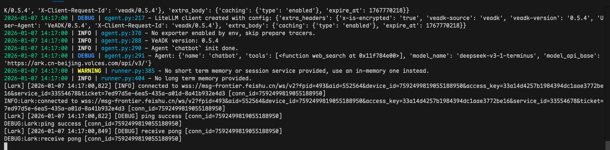
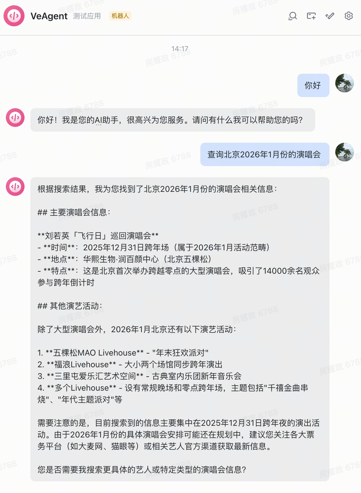

# VeADK Agent 飞书机器人

本模板项目提供了一个简单的基于 VeADK Agent 的飞书机器人脚手架。

## 项目结构

```bash
.
├── README.md
├── agent               # Agent 代码目录
│   ├── __init__.py
│   └── agent.py
├── main.py             # 主程序
├── requirements.txt    # 项目依赖
├── .env.example        # 环境变量示例
└── start.sh            # 启动脚本
```

## 快速开始

### 准备环境变量

1. 复制 `.env.example` 为 `.env` 文件
2. 在 `.env` 文件中：填写飞书应用的 `APP_ID` 和 `APP_SECRET`（创建飞书应用[快捷入口](https://open.larkoffice.com/document/develop-an-echo-bot/introduction?from=banner)）；填写火山引擎 AK / SK

### 依赖安装

请确保您的 Python 版本大于 3.10

```bash
pip install -r requirements.txt
```

### 启动项目

通过以下命令启动：

```bash
bash start.sh
```

或：

```bash
python -m main
```

## 效果展示

### 服务端



### 客户端（飞书）



## 扩展开发

- 自定义您的 Agent 逻辑，参考 `agent/agent.py`；若您想实现更加复杂的 Agent 执行引擎逻辑，请编辑 `agent/agent.py` 中的 `run_agent` 方法
- 自定义您的飞书机器人消息逻辑，请编辑 `main.py` 中的  `do_p2_im_message_receive_v1` 函数
